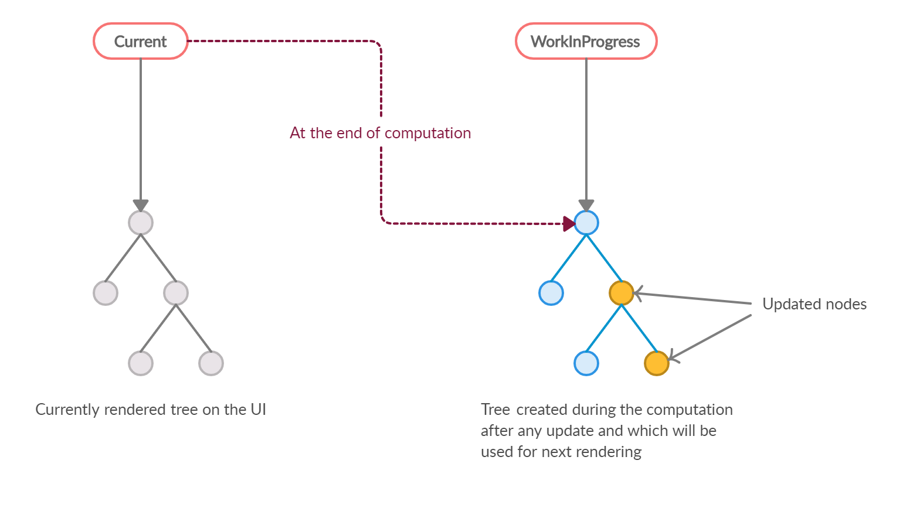
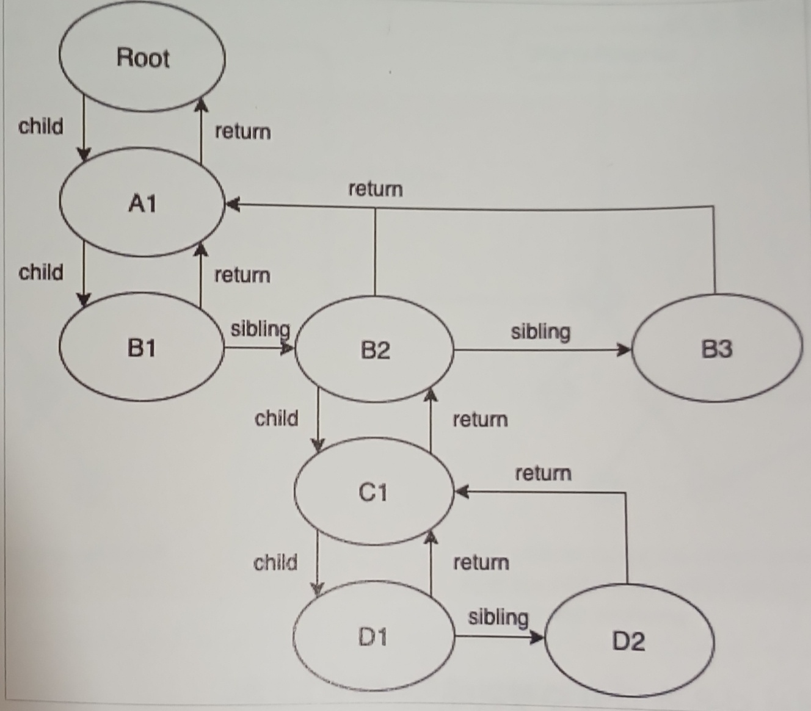
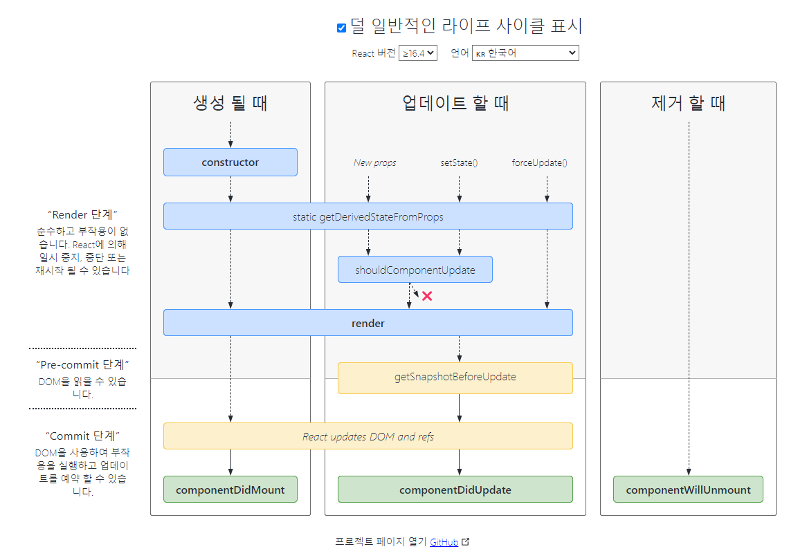

# 목차

- 2.1 [JSX](#jsx)
- 2.2 [가상 DOM과 리액트 파이버](#가상-dom과-리액트-파이버)
- 2.3 [클래스 컴포넌트와 함수 컴포넌트](#클래스-컴포넌트와-함수-컴포넌트)
- 2.4 [렌더링은 어떻게 일어나는가?](#렌더링은-어떻게-일어나는가)
- 2.5 [컴포넌트 함수의 무거운 연산을 기억해 두는 메모이제이션](#컴포넌트-함수의-무거운-연산을-기억해-두는-메모이제이션)

# JSX

JSX는 React의 등장과 함께 페이스북(현 메타)에서 소개된 구문으로, 기본적으로 HTML이나 XML과 같은 구조를 자바스크립트 내부에서 표현하는 데 사용됩니다. 뿐만 아니라, JSX는 이러한 구조를 트랜스파일러를 통해 표준 자바스크립트(ECMAScript)로 변환하는 데 초점을 두고 있으며, React 외의 환경에서도 활용될 수 있습니다.

## JSX의 정의

JSX는 기본적으로 `JSXElement`, `JSXAttributes`, `JSXChildren`, `JSXStrings`라는 4가지 컴포넌트를 기반으로 구성돼 있다.

### JSXElement

JSX를 구성하는 가장 기본 요소로, HTML의 요소(elemnet)와 비슷한 역할을 한다. `JSXElement`가 되기 위해서는 다음과 같은 형태 중 하나여야 한다.

- **JSXOpeningElemnet**:
  - 일반적으로 볼 수 있는 요소이다.
  - `JSXOpeningElemnet`로 시작했다면 `JSXClossingElement`가 같은 depth에 선언돼 있어야 올바른 JSX 문법으로 간주된다.
  - ex) `<JSXElement JSXAttributes(optional)>`
- **JSXClossingElement**:
  - `JSXOpeningElemnet`가 종료됐음을 알리는 요소로, 반드시 `JSXOpeningElemnet`와 쌍으로 사용해야 한다.
  - ex) `</JSXElement>`
- **JSXSelfClosingElement**
  - 요소가 시작되고, 스스로 종료되는 형태를 의미한다.
  - `<script />`와 동일한 모습을 띄고 있다.
  - 이는 내부적으로 자식을 포함할 수 없는 형태를 의미한다.
  - ex) `<JSXElement JSXAttributes(optional) />`
- **JSXFragement**
  - 아무런 요소가 없는 형태로, `JSXSelfClosingElement` 형태를 띌 수는 없다.
  - `</>`는 불가능하다. 단 `<></>` 형태는 가능하다.
  - ex) `<>JSXChildren(optional)</>`

<aside>
💡

**요소명은 대문자로 시작해야만 되는 거 아닌가요?**

- JSXElement 문법에는 명시되어 있지 않은 내용
- React에서는 HTML 구문 이외에 사용자가 컴포넌트를 만들 경우 반드시 대문자로 시작하는 컴포넌트를 만들어야 사용 가능하다.
- React에서 HTML 태그명과 사용자 컴포넌트 태그명을 구분 짓기 위함이다.
- HTML 태그명을 따로 필터링 하지 않는 이유는 HTML의 확장성을 염두하고 있어서이다.
</aside>

### JSXElementName

JSXElementName은 JSXElement의 이름으로 사용가능한 것들을 의미합니다.

- **JSXIndetifier**

  - JSX 내부에서 사용할 수 있는 식별자를 의미한다.
  - 자바스크립트의 식별자 규칙과 동일
  - 숫자로 시작하거나 `$`와 `_`외의 다른 특수 문자로는 시작할 수 없다.
  - 예시

    ```jsx
    function Valid1() {
    	return <$></$>
    }

    function Valid2() {
    	return <_></_>
    }

    // 불가능
    function InValid1() {
    	return <1></1>
    }
    ```

- **JSXNamespacedName(React에선 사용 X)**

  - `JSXIndetifier:JSXIndetifier`의 조합, 즉 `:`을 통해 서로 다른 식별자를 이어주는 것도 하나의 식별자로 취급된다.
  - `:`로 묶을 수 있는 것은 한 개 뿐이다. 두 개 이상은 올바른 식별자로 취급되지 않는다.
  - 예시

    ```jsx
    function Valid() {
    	return <foo:bar></foo:bar>
    }

    // 불가능
    function InValid() {
    	return <foo:bar:baz></foo:bar:baz>
    }
    ```

- **JSXMemberExpression(React에선 사용 X)**

  - `JSXIndetifier.JSXIndetifier`의 조합, 즉 `.`을 통해 서로 다른 식별자를 이어주는 것도 하나의 식별자로 취급된다.
  - `:`로 묶는 `JSXNamespacedName`과는 다르게 `.`을 여러 개 이어서 하는 것도 가능하다.
  - 단 `JSXNamespacedName`과 이어서 사용하는 것은 불가능 하다.
  - 예시

    ```jsx
    function Valid1() {
    	return <foo.bar></foo.bar>
    }

    function Valid2() {
    	return <foo.bar.baz></foo.bar.baz>
    }

    // 불가능
    function InValid() {
    	return <foo:bar.baz></foo:bar.baz>
    }
    ```

### JSXAttributes

JSXElement에 부여할 수 있는 속성을 의미한다. 단순히 속성을 의미하기 때문에 모든 경우에서 필수 값이 아니고, 없다고 에러가 나지 않는다.

- **JSXSpreadAttributes**

  - 자바스크립트의 전개 연산자와 동일한 역할
  - **{…AssignmentExpression}**

    - 이때 `AssignmentExpression`에는 객체뿐만 아니라 조건문 표현식, 화살표 함수, 할당식 등의 모든 표현식이 들어올 수 있습니다.

      ```jsx
      const props = { id: 1, name: "John" };
      const element = <Component {...props} />;

      // 삼항 연산의 결과인 obj를 전개
      const obj = { a: 1 };
      const component = <MyComponent {...(true ? obj : { b: 2 })} />;

      // 함수의 반환 값인 obj를 전개
      const obj = { a: 1 };
      const component = <MyComponent {...(() => obj)()} />;
      ```

- **JSXAttribute**

  - 속성을 나타내는 키와 값으로 짝을 이루어서 표현한다.
  - **JSXAttributeName**
    - 속성의 키 값
    - 키로는 `JSXElementName`에서 언급한 `JSXIdentifier`와 `JSXNamespacedName`이 가능하다.
      ```jsx
      function Valid1() {
        return <foo.bar foo:bar="baz"></foo.bar>;
      }
      ```
  - **JSXAttributeValue**

    - 속성의 키에 할당할 수 있는 값으로, 다음 중 하나에 만족해야 함
    - `“큰따옴표로 구성된 문자열”`: JS문자열과 동일. 내용이 없어도 됨
    - `‘작은따옴표로 구성된 문자열’`: JS문자열과 동일. 내용이 없어도 됨
    - `{ AssignmentExpression }`: `AssignmentExpression`는 JS의 변수에 값으로 넣을 수 있는 모든 표현식을 의미한다.
    - `JSXElement`: 값으로 다른 JSX 요소가 들어갈 수 있다.

      ```jsx
      function Child({ attribute }) {
        return <div>{attribute}</div>;
      }

      export default function App() {
        return (
          <div>
            <Child attribute=<div>hello</div> />
          </div>
        );
      }
      ```

      - 대부분의 React 개발자들은 `<Child attribute={<div>hello</div>} />`와 같이 값으로 들어가는 React component를 `{}`로 감싸는 것이 더 익숙할텐데, 사실 이것은 문법 오류가 아닌 prettier 규칙이다. 이 규칙은 가독성을 더 높이기 위해 제공된다.

    - `JSXFragment`: 값으로 별도 속성을 갖지 않는 형태의 JSX 요소이다. 즉, 비어있는 형태의 `<></>`가 허용된다.

### JSXChildren

JSXElement의 자식 값을 나타낸다. JSX는 속성을 가진 트리 구조를 나타내기 위해 만들어졌기 때문에 JSX로 부모와 자식 관계를 나타낼 수 있으며, 그 자식을 JSXChildren이라고 한다.

- **JSXChild**
  - JSXChildren을 이루는 기본 단위다.
  - JSXChildren은 JSXChild를 0개 이상 가질 수 있다.
  - 0개를 보면 알 수 있듯 JSXChildren은 JSXChild 가 없어도 된다.
  - `JSXText`
    - `{`, `<`, `>`, `}` 을 제외한 문자열. 이는 다른 JSX문법에 혼동을 줄 수 있기 때문
    - 만약 위 문자를 표현하고 싶다면 따옴표 안에 넣으면 된다.
      ```jsx
      function Vaild() {
        return <>{"{} <>"}</>;
      }
      ```
  - `JSXElement`
    - 값으로 다른 JSX 요소가 들어갈 수 있다.
  - `JSXFragment`
    - 값으로 빈 JSX 요소인 `<></>`가 들어갈 수 있다.
  - `{ JSXChildExpression (optional) }`
    - 이 `JSXChildExpression`는 자바스크립트의 `AssignmentExpression`을 의미한다.
      ```jsx
      // 이 함수를 리액트에서 렌더링하면 "foo"라는 문자열이 출력된다.
      export default function App() {
        return <>{(() => "foo")()}</>;
      }
      ```

### JSXStrings

JSX 문법 내에서 문자열을 처리하는 방법으로 앞서 설명한 `JSXText`와 `JSXAttributeValue`의 따옴표가 이에 포함되며 HTML에서 쓸 수 있는 문자열은 모두 사용가능하다.

주의할 점은 이스케이프 문자 처리에 신경써야 된다.

```jsx
// HTML에서는 \ 문자를 그대로 사용할 수 있다.
<button>\</button>

// JSX에서는 \ 문자를 그대로 사용하면 에러가 발생한다.
return <button>\</button>; // SyntaxError: Unexpected token

// JSX에서 \ 문자를 올바르게 사용하려면 이스케이프 처리를 해야 한다.
return <button>\\</button>; // 올바른 표현

// JavaScript 문자열 내에서 \ 문자를 이스케이프 처리하지 않으면 에러가 발생한다.
let escape1 = "\"; // SyntaxError: Invalid or unexpected token

// \ 문자를 올바르게 이스케이프 처리한 경우
let escape2 = "\\"; // 올바른 표현
```

## JSX는 어떻게 변환되는가

JSX는 `@babel/plugin-transform-react-jsx`를 통해 자바스크립트가 이해할 수 있는 형태로 변환한다.

다음과 같은 JSX 코드가 있다고 가정해보자

```jsx
const ComponentA = <A required={true}>Hello World</A>;

const ComponentB = <>Hello World</>;

const ComponentC = (
  <div>
    <span>hello world</span>
  </div>
);
```

이를 변환한 결과는 다음과 같다.

```jsx
// @babel/plugin-transform-react-jsx로 변환한 결과
"use strict";

var ComponentA = React.createElement(
  A,
  {
    required: true,
  },
  "Hello World"
);
var ComponentB = React.createElement(React.Fragment, null, "Hello World");
var ComponentC = React.createElement(
  "div",
  null,
  React.createElement("span", null, "hello world")
);
```

React 17, babel 7.9.0 이후 버전에서 추가된 자동 런타임(automatic runtime)으로 트랜스파일한 결과는 다음과 같다.(두 결과의 자세한 차이점은 8장에서 설명)

```jsx
// 자동 런타임(automatic runtime)으로 변환한 결과
"use strict";

var _jsxRuntime = require("custom-jsx-libray/jsx-runtime");

var ComponentA = (0, _jsxRuntime.jsx)(A, {
  required: true,
  children: "Hello World",
});

var ComponentB = (0, _jsxRuntime.jsx)(_jsxRuntime.Fragment, {
  children: "Hello World",
});

var ComponentC = (0, _jsxRuntime.jsx)("div", {
  children: (0, _jsxRuntime.jsx)("span", {
    children: "hello world",
  }),
});
```

두 결과물에는 약간의 차이가 있지만 다음과 같은 공통점이 있다.

- JSXElement를 첫 번째 인수로 선언해 요소를 정의한다.
- 옵셔널인 `JSXChildren`, `JSXAttributes`, `JSXStrings`는 이후 인수로 넘겨주어 처리한다.

이러한 공통점을 활용한다면 경우에 따라 다른 JSXElement를 렌더링해야할 때 굳이 요소 전체를 감싸지 않아도 처리할 수 있다. 이는 JSXElement만 다르고, `JSXChildren`, `JSXAttributes`이 완전히 동일한 상황에서 중복 코드를 최소화 할 수 있다.

```jsx
// JSX가 변환되는 특성을 이용

// X props 여부에 따라 children 요소만 달라지는 경우
// 굳이 전체 내용을 삼항 연산자로 처리할 필요가 없다.
// 이 경우 불필요한 코드 중복이 일어난다.
function TextOrHeading({ isHeading, children }) {
  return isHeading ? (
    <h1 className="text">{children}</h1>
  ) : (
    <span className="text">{children}</span>
  );
}

// O JSX가 변환되는 특성을 활용하면 다음과 같이 간결하게 바꿀 수 있다.
import { createElement } from "react";

function TextOrHeading({ isHeading, children }) {
  return createElement(
    isHeading ? "h1" : "span",
    { className: "text" },
    children
  );
}
```

JSX 반환 값이 결국 `React.createElement`로 귀결된다는 사실을 파악한다면 이런 식으로 쉽게 리팩터링할 수 있다.

# 가상 DOM과 리액트 파이버

## DOM과 브라우저 렌더링 과정

1. 브라우저가 사용자가 요청한 주소를 방문해 HTML 파일을 다운로드한다.
2. 브라우저의 렌더링 엔진은 HTML을 파싱해 DOM 노드로 구성된 트리(DOM)를 만든다.
3. 2번 과정에서 CSS 파일을 만나면 해당 CSS 파일도 다운로드 한다.
4. 브라우저의 렌더링 엔진은 이 CSS도 파싱해 CSS 노드로 구성된 트리(CSSOM)를 만든다.
5. 브라우저는 2번에서 만든 DOM 노드를 순회하는데, 여기서 모든 노드를 방문하는 것이 아니고, 사용자 눈에 보이는 노드만 방문한다. 즉, `display: none`과 같이 사용자 화면에 보이지 않는 요소는 방문해 작업하지 않는다. 이는 트리를 분석하는 과정으로 조금이라도 빠르게 하기 위해서다.
6. 5번에서 방문한, 눈에 보이는 노드를 대상으로 해당 노드에 대한 CSSOM 정보를 찾고 여기서 발견한 CSS 스타일 정보를 DOM 노드에 적용하여 렌더트리를 만든다. DOM 노드에 CSS를 적용하는 과정은 크게 두 가지로 나눌 수 있다.
   - 레이아웃(layout, reflow): 각 노드가 브라우저 화면의 어느 좌표에 정확히 나타나야 하는지 계산하는 과정. 이 레이아웃 과정을 거치면 반드시 페인팅 과정도 거치게 된다.
   - 페인팅(painting): 레이아웃 단계를 거친 노드에 색과 같은 실제 유효한 모습을 그리는 과정


## 가상 DOM의 탄생 배경

웹페이지를 렌더링하는 과정은 매우 복잡하고 많은 비용이 든다. 웹이 발전하면서 초기 렌더링 이후에도 사용자 인터랙션을 통해 웹페이지가 자주 변경된다. 특히 SPA (Single Page Application) 환경에서는 하나의 페이지 내에서 요소의 위치를 계속 재계산해야 한다. 라우팅이 변경될 때, 사이드바나 헤더 같은 특정 요소를 제외한 대부분의 요소를 삭제하고, 다시 삽입하고, 위치를 재계산해야 한다.

이로 인해 사용자는 페이지 깜박임 없이 자연스러운 탐색을 할 수 있지만, DOM의 관리 부담은 증가한다. 개발자가 모든 인터랙션에 따른 DOM 변화를 추적하는 것은 매우 번거롭다. 대부분의 개발자는 인터랙션 과정에서의 모든 DOM 변경 사항보다는 최종적인 DOM 변화를 알고 싶어한다. 이러한 문제를 해결하기 위해 가상 DOM이 만들어졌다.

### 가상 DOM

웹페이지가 표시해야 할 DOM을 일단 메모리에 저장하고 React가 실제 변경에 대한 준비가 완료됐을 때 실제 브라우저 DOM에 반영한다. 이렇게 DOM 계산을 브라우저가 아닌 메모리에서 계산하는 과정을 한번 거치게 되면 실제로 여러 번 발생했을 렌더링 과정을 최소화 할 수 있다.

## 가상 DOM을 위한 아키텍처, 리액트 파이버

React에서 가상 DOM과 렌더링 과정 최적화를 가능하게 해주는 것이 바로 리액트 파이버이다.

### 리액트 파이버

- 리액트에서 관리하는 평범한 자바스크립트 객체
- 파이버 재조정자(fiber reconciler)에 의해 관리됨
  - 파이버 재조정자는 DOM과 DOM 사이의 변경 사항을 수집하고, 두 사이에 차이가 발생하면 변경 정보를 가진 파이버를 기준으로 화면에 렌더링을 요청합니다.
- 리액트 파이버의 기능
  - **작업 분할 및 우선순위 부여**:
    - 작업을 작은 단위로 분할하고, 각 작업에 우선순위를 부여합니다.
  - **작업 일시 중지 및 재개**:
    - 작업을 일시 중지하고 나중에 다시 시작할 수 있습니다.
  - **작업 재사용 및 폐기**:
    - 이전에 했던 작업을 재사용하거나 필요 없을 경우 폐기할 수 있습니다.
- 위에 설명한 기능들이 모두 비동기로 실행
  - 기존 동기적 렌더링 스택의 비효율성을 타파하기 위해 **비동기적으로 작업을 수행하는 파이버라는 개념**이 탄생했습니다.
  - 리액트 파이버의 작업은 모두 비동기로 처리되어, 사용자 인터페이스를 더 부드럽고 빠르게 만듭니다.
- 파이버의 작업 단계
  - **렌더 단계**
    - 리액트는 사용자에게 노출되지 않는 모든 비동기 작업을 이 단계에서 수행합니다.
    - 이 단계에서 파이버의 작업, 우선순위 지정, 작업 일시 중지 및 폐기 등이 발생합니다.
  - **커밋 단계**
    - DOM에 실제 변경 사항을 반영하는 단계로, `commitWork()`가 실행됩니다.
    - 이 과정은 동기적으로 일어나며 중단될 수 없습니다.

### 리액트 내부 코드로 보는 파이버

- 리액트 내부 코드의 파이버 객체

```jsx
function FiberNode(tag, pendingProps, key, mode) {
  // Instance
  this.tag = tag;
  this.key = key;
  this.elementType = null;
  this.type = null;
  this.stateNode = null;

  // Fiber
  this.return = null;
  this.child = null;
  this.sibling = null;
  this.index = 0;
  this.ref = null;
  this.refCleanup = null;

  this.pendingProps = pendingProps;
  this.memoizedProps = null;
  this.updateQueue = null;
  this.memoizedState = null;
  this.dependencies = null;

  this.mode = mode;

  // Effects
  this.flags = NoFlags;
  this.subtreeFlags = NoFlags;
  this.deletions = null;

  this.lanes = NoLanes;
  this.childLanes = NoLanes;

  this.alternate = NoLanes;

  // 이하 프로파일러, __DEV__ 코드는 생략
}
```

보다시피 파이버는 단순한 자바스크립트 객체로 구성되어 있다.

보통 React 요소는 렌더링이 발생할 때마다 새롭게 생성되지만 파이버는 가급적이면 재사용된다. 컴포넌트가 최초로 마운트되는 시점에 생성되어 이후에는 가급적이면 재사용한다.

- 리액트에 작성돼 있는 파이버를 생성하는 다양한 함수

```jsx
var createFiber = function (tag, pendingProps, key, mode) {
	return new FiberNode(tag, pendingProps, key, mode)
}

// 생략...
function createFiberFromElement(element, mode, lanes) {
	var owner = null

	{
		owner = element._owner
	}

	var type = element.type
	var key = element.key
	var pendingProps = element.props
	var fiber = createFiberFromTypeAndProps(
		type,
		key,
		pendingProps,
		owner,
		mode
		lanes,
	)

	{
		fiber._debugSource = element._source
		fiber._debugOwner = element._owner
	}

	return fiber
}

function createFiberFromFragment(element, mode, lanes, key) {
	var fiber = createFiber(Fragment, elements, key, mode)
	fiber.lanes = lanes
	return fiber
}
```

함수명을 보면 알 수 있듯이 리액트 파이버는 하나의 element와 1:1로 대응된다.

이제 리액트 파이버의 주요 속성을 알아보자

- **tag**
  - 파이버와 element의 1:1로 매칭된 정보를 가지고 있다. 1:1로 연결 되는 것은 React Component일 수도, HTML의 DOM 노드일 수도, 혹은 다른 어떤 것일 수도 있다.
  - React에 작성되어 있는 파이버의 태그가 가질 수 있는 값들
    ```jsx
    var FunctionComponent = 0; // 함수형 컴포넌트
    var ClassComponent = 1; // 클래스형 컴포넌트
    var IndeterminateComponent = 2; // 함수형인지 클래스형인지 알기 전 상태
    var HostRoot = 3; // 호스트 트리의 루트
    var HostPortal = 4; // 서브트리, 다른 렌더러의 진입점이 될 수 있음
    var HostComponent = 5; // 일반 HTML 요소
    var HostText = 6; // 텍스트 노드
    var Fragment = 7; // 프래그먼트
    var Mode = 8; // 모드
    var ContextConsumer = 9; // 컨텍스트 소비자
    var ContextProvider = 10; // 컨텍스트 제공자
    var ForwardRef = 11; // 참조 전달
    var Profiler = 12; // 성능 프로파일러
    var SuspenseComponent = 13; // 서스펜스 컴포넌트
    var MemoComponent = 14; // 메모 컴포넌트
    var SimpleMemoComponent = 15; // 간단한 메모 컴포넌트
    var LazyComponent = 16; // 레이지 로딩 컴포넌트
    var IncompleteClassComponent = 17; // 불완전한 클래스형 컴포넌트
    var DehydratedFragment = 18; // 비활성화된 프래그먼트
    var SuspenseListComponent = 19; // 서스펜스 리스트 컴포넌트
    var ScopeComponent = 21; // 스코프 컴포넌트
    var OffscreenComponent = 22; // 오프스크린 컴포넌트
    var LegacyHiddenComponent = 23; // 레거시 히든 컴포넌트
    var CacheComponent = 24; // 캐시 컴포넌트
    var TracingMarkerComponent = 25; // 트레이싱 마커 컴포넌트
    ```
- **stateNode**
  - 파이버 자체에 대한 참조(reference) 정보를 가지고 있다.
  - 이 참조를 바탕으로 React는 파이버와 관련된 상태에 접근한다.
- **child, sibling, return**

  - 파이버 간의 관계를 나타내는 속성이다.
  - 리액트 컴포넌트가 트리를 가지는 것 처럼 파이버도 트리를 가짐
    - 이 트리의 관계를 정의하는데 필요한 요소가 **child, sibling, return**
  - 리액트 트리와 다른 점은 하나의 child만 가질 수 있다.
  - 위에서 파이버 트리는 하나의 child만 가질 수 있다고 하였는데, 그렇다면 아래와 같은 여러 자식을 가지는 구조는 어떻게 표현 할까?

    ```jsx
    <ul>
      <li>하나</li>
      <li>둘</li>
      <li>셋</li>
    </ul>
    ```

    파이버는 항상 첫 번째 자식의 참조로 구성이 되며 나머지 형제는 sibling으로 구성하게 된다.

    ```jsx
    const l3 = {
      return: ul,
      index: 2,
    };

    const l2 = {
      sibling: l3,
      return: ul,
      index: 1,
    };

    const l1 = {
      sibling: l2,
      return: ul,
      index: 1,
    };

    const ul = {
      // ...
      child: l1,
    };
    ```

- **index**
  - 여러 형제들(sibling) 사이에서 자신의 위치가 몇 번째인지 숫자로 표현
- **pendingProps**
  - 아직 작업을 미처 처리하지 못한 props
- **mempizedProps**
  - pendingProps를 기준으로 렌더링이 완료된 이후에 pendingProps를 mempizedProps로 저장하여 관리
- **updateQueue**
  - 상태 업데이트, 콜백 함수, DOM 업데이트 등 필요한 작업을 담아두는 큐
  - 구조
    ```tsx
    type UpdateQueue = {
      first: Update | null;
      last: Update | null;
      hasForceUpdate: boolean;
      callbackList: null | Array<Callback>; // setState로 넘긴 콜백 목록
    };
    ```
- **memorizedState**
  - 함수 컴포넌트의 훅 목록이 저장
  - useState뿐만 아니라 모든 훅 리스트가 저장됨
- **alternate**
  - 뒤이어 설명할 리액트 파이버 트리와 연관된 내용
  - 리액트 파이버 트리는 두개인데, 그 반대편 파이버 트리는 가리킨다.

이렇게 생성된 파이버는 상태가 변경되거나 생명주기 메서드가 실행되거나 DOM의 변경이 필요한 시점 등에 실행된다. 리액트는 파이버를 처리할 때마다 파이버의 우선순위를 매겨 중요한 작업은 빨리 실행하고 덜 중요한 작업은 늦게 실행하는 등의 스케줄링을 한다.

### 리액트 파이버 트리

- 리액트 파이버들의 부모-자식 관계를 나타내는 트리
- 리액트 내부에 두 개가 존재
  - 현재의 모습을 담은 파이버 트리
  - 작업 중인 상태를 나타내는 workInProcess 트리
- 리액트 파이버의 작업이 끝나면 workInProcess 트리를 현재 트리로 변경한다.
  - 더블 버퍼링이라고 부른다.
- 하나의 트리 만을 사용하는 경우 불완전한 화면을 노출 할 수 있기 때문이다.

리액트 파이버 트리의 동작 순서



1. current 트리를 기준으로 현재 UI 렌더링
2. 업데이트 발생 시 current를 기준으로 새로운 workInProcess 빌드
3. workInProcess 트리를 기준으로 변경된 UI 렌더링
4. workInProcess 트리가 current 트리로 변경

### 파이버의 작업 순서

파이버 트리와 파이버가 어떤 식으로 작동하는지 흐름을 살펴보자. 먼저 일반적인 파이버 노드의 생성 흐름은 다음과 같다.

1. 리액트는 `beginWork()` 함수를 실행해 파이버 작업을 수행하는데, 더 이상 자식이 없는 파이버를 만날 때까지 깊게 들어간다.
2. 1번에서 작업이 끝난다면 그다음 `completeWork()` 함수를 실행해 파이버 작업을 완료한다.
3. 형제가 있다면 형제로 넘어간다.
4. 2번, 3번이 모두 끝났다면 return으로 돌아가 자신의 작업이 완료됐음을 알린다.

다음 예제 코드를 통해 확인해 보자.

```jsx
<A1>
  <B1>안녕하세요</B1>
  <B2>
    <C1>
      <D1 />
      <D2 />
    </C1>
  </B2>
  <B3 />
</A1>
```

위 작업은 JSX코드에서 다음과 같은 순서로 실행된다.

1. `A1`의 `beginWork()` 가 수행된다.
2. `A1`은 자식이 있으므로 B1으로 이동해 `beginWork()`를 수행한다.
3. `B1`은 자식이 없으므로 `completeWork()`가 수행됐다. 자식이 없으므로 형제인 `B2`로 넘어간다.
4. `B2`의 `beginWork()`가 수행된다. 자식이 있으므로 `C1`으로 이동한다.
5. `C1`의 `beginWork()`가 수행된다. 자식이 있으므로 `D1`으로 이동한다.
6. `D1`의 `beginWork()`가 수행된다.
7. `D1`은 자식이 없으므로 `completWork()`가 수행됐다. 자식은 없으므로 형제인 `D2`로 넘어간다.
8. `D2`는 자식이 없으므로 `completWork()`가 수행됐다.
9. `D2`는 자식도 더 이상의 형제도 없으므로 위로 이동해 `D1`, `C1`, `B1` 순으로 `completeWork()`를 호출한다.
10. `B2`는 형제인 `B3`로 이동해 `beginWork()`를 수행한다.
11. `B3`의 `completeWork()`가 수행되면 반환해 상위로 타고 올라간다.
12. `A1`의 `completeWork()`가 수행된다.
13. 루트 노드가 완성되는 순간, 최종적으로 `commitWork()`가 수행되고 이 중에 변경 사항을 비교해 업데이트가 필요한 변경 사항이 DOM에 반영된다.

이렇게 생성한 트리를 도식화하면 다음과 같다.



이렇게 트리가 생성됐다. 이제 여기서 setState 등으로 업데이트가 발생하면 어떻게 될까?

1. 업데이트 요청을 받아 workInProgregg 트리를 다시 빌드하기 시작
   - 이미 리액트는 앞서 만든 current 트리가 존재
   - 이 빌드 과정은 앞서 트리를 만드는 과정과 동일
2. 파이버 재사용
   - 파이버가 이미 존재하므로 되도록 새로 생성 X
   - 최초 렌더링 시에는 모든 파이버를 새롭게 생성해야 했음
3. 업데이트된 props 처리
   - 기존 파이버에서 업데이트된 props를 받아 파이버 내부에서 처리

이제 앞에서 언급한 것들을 다시 살펴보자

**가급적 새로운 파이버를 생성하지 않는다.**

- 트리를 비교하고 업데이트하는 과정은 빈번하게 발생한다.
- 이러한 반복적인 재조정 작업마다 새로운 파이버 객체를 생성하는 것은 리소스 낭비다.
- 따라서, 새로운 객체를 만들기보다는 기존에 있는 객체를 재활용하기 위해 내부 속성 값만 초기화하거나 바꾸는 형태로 트리를 업데이트한다.

**과거에는 동기식으로 처리했지만 비동기로 변경**

- 과거에는 이 트리 업데이트 과정이 동기식으로 처리되어 중단될 수 없었다.
- 현재는 우선순위에 따라 비동기적으로 작업을 수행한다.
  - 우선순위에 따라 현재 작업을 중단하거나, 새롭게 실행하거나, 폐기할 수 있다.
- 리액트는 작업을 파이버 단위로 나눠서 수행한다.
  - 애니메이션이나 사용자가 입력하는 작업을 높은 우선순위로 분류한다.
  - 목록을 렌더링하는 등의 작업을 낮은 우선순위로 분류한다.
  - 이로써 최적의 순위로 작업을 완료할 수 있게 한다.

## 파이버와 가상 DOM

- **가상 DOM**:
  - 가상 DOM은 웹 애플리케이션에서만 사용된다.
  - 리액트 네이티브와 같은 브라우저가 아닌 환경에서는 사용되지 않는다.
- **리액트 파이버**:
  - 리액트 파이버는 브라우저가 아닌 환경에서도 사용 가능하다.
  - 리액트와 리액트 네이티브의 렌더러가 서로 다르더라도, 내부적으로 파이버를 통해서 조정되는 과정은 동일하다.
  - 이를 통해 재

# 클래스 컴포넌트와 함수 컴포넌트

## 클래스 컴포넌트

- 지금은 사용하지 않더라도 기본적인 구조를 알아 둘 필요가 있다.
  - 리액트 16.8 미만의 버전에서는 대부분의 코드가 클래스 컴포넌트로 작성되있음
  - 오래된 코드의 유지 보수를 위해 필요
  - 오래된 라이브러리 등을 사용할 때 도움이 됨

### React.Component VS React.PureComponent

클래스 컴포넌트에는 두 가지의 유형이 있다

- React.Component
  - state가 업데이트 되면 리렌더링 발생
- React.PureComponent
  - state의 값을 얕은 비교해서 다른 값을 경우에만 리렌더링 발생

클래스 컴포넌트의 예제를 보며 알아보자

### 클래스 컴포넌트 예제

```tsx
import React from "react";

// props 타입을 선언한다.
interface SampleProps {
  required?: boolean;
  text: string;
}

// state 타입을 선언한다.
interface SampleState {
  count: number;
  isLimited?: boolean;
}

// Component에 제네릭으로 props, state를 순서대로 넣어준다.
class SampleComponent extends React.Component<SampleProps, SampleState> {
  // constructor에서 props를 넘겨주고, state의 기본값을 설정한다.
  private constructor(props: SampleProps) {
    super(props);
    this.state = {
      count: 0,
      isLimited: false,
    };
  }

  // render 내부에 쓰일 함수를 선언한다.
  private handleClick = () => {
    const newValue = this.state.count + 1;
    this.setState({ count: newValue, isLimited: (newValue) => 10 });
  };

  // render에서 이 컴포넌트가 렌더링할 내용을 정의한다.
  public render() {
    // props와 state 값을 this, 즉 해당 클래스에서 꺼낸다.
    const {
      props: { required, text },
      state: { count, isLimited },
    } = this;

    return (
      <h2>
        Sample Component
        <div>{required ? "필수" : "필수아님"}</div>
        <div>문자: {text}</div>
        <div>count: {count}</div>
        <button onClick={this.handleClick} disabled={isLimited}>
          증가
        </button>
      </h2>
    );
  }
}
```

위 예제의 코드를 부분별로 살펴보자

- `constructor()`
  - 컴포넌트가 초기화되는 시점에 호출되는 초기화 함수
  - 여기서는 컴포넌트의 state를 초기화 할수 있다.
  - `super()`는 상속받은 상위 컴포넌트, 즉 `React.Componet`의 생성자 함수를 호출한다.
- props
  - 컴포넌트에 특정 속성을 전달하는 용도로 사용
- state
  - 클래스 컴포넌트 내부에서 관리하는 값
  - 항상 객체여야 한다.
  - 값에 변화가 발생 했을 때마다 리렌더링된다.
- 메서드
  - 렌더링 함수 내부에서 사용되는 함수
  - 보통 DOM에서 발생하는 이벤트와 함께 사용된다.
  - 3가지의 방식으로 만들 수 있다.
    - constructor에서 this 바인드 하는 방법: bind 메서드를 사용하여 명시적으로 바인딩
    - 화살표 함수를 쓰는 방법: 작성 시점에 this가 상위 스코프에 바인딩
    - 렌더링 함수 내부에서 함수를 새롭게 만들어 전달하는 방법: 매 렌더링 마다 새로운 함수를 생성해서 최적화가 어려움 ⇒ 지양하는 것이 좋다

## 클래스 컴포넌트의 생명 주기 메서드

### 생명 주기 메서드가 실행되는 3가지 시점

- 마운트(mount): 컴포넌트가 마운팅(생성)되는 시점
- 업데이트(update): 이미 생서된 컴포넌트의 내용이 변경(업데이트)되는 시점
- 언마운트(unmount): 컴포넌트가 더이상 존재하지 않는 시점

이 3가지 시점을 염두에 두고 각 생명 주기 메서드를 살펴보자

### render()

- `mount`와 `update`과정에서 일어남
- 컴포넌트가 UI를 렌더링하기 위해 사용
- 리액트 클래스 컴포넌트의 유일한 필수 값
- 항상 순수하고 부수 효과(side-effects)가 없어야 한다.
  - 내부에서 직접 state를 업데이트 하는 `this.setState`를 호출해서는 안된다.

### componentDidMount()

- 컴포넌트가 `mount`된 이후에 즉시 실행
- `this.setState` 호출 가능
  - 사용 시 컴포넌트가 즉시 `update`되어 리렌더링된다.
- 생성자 함수에서 할 수 없는 상태 변화만 다루는 게 좋다.
  - 불필요한 리렌더링은 성능 문제를 일으킬 수 있다.
  - ex) API 호출 후 update, DOM에 의존적인 작업(이벤트 리스너 추가 등)

### componentDidUpdate()

- 컴포넌트가 `update`된 이후에 즉시 실행
- state나 props의 변화에 따라 DOM을 업데이트 하는 등에 사용
- `this.setState` 호출 가능
  - 적절한 조건을 달지 않으면 무한 루프가 일어남에 주의해야 한다.
    ```tsx
    componentDidUpdate(prevProps: Props, prevState: State) {
    	// 만약 이러한 조건문이 없다면 props가 변경되는 매 순간마다 fetchData가
    	// 실행되는 불상사가 발생할 것이다.
    	// 이 조건문 덕분에 props의 userName이 이전과 다른 경우에만 호출될 것이다.
    	if (this.props.userName !== prevProps.userName) {
    		this.fetchData(this.props.userName);
    	}
    }
    ```

### componentWillUnmount()

- 컴포넌트가 언마운트되거나 더 이상 사용되지 않기 직전에 실행
- `this.setState` 호출 불가
- 메모리 누수나 불필요한 작동을 막기 위한 클린업 함수를 호출하기 최적의 위치
  - 이벤트를 지우거나, API 호출을 취소하거나, setInterval, setTimeout으로 생성된 타이머를 지우는 등의 작업을 하는데 유용
    ```tsx
    componentWillUnmount() {
    	window.removeEventListener("resize", this.resizeListener)
    	clearInterval(this.intervalid)
    }
    ```

### shouldComponentUpdate()

- state나 props의 변경으로 인한 리렌더링을 조절할 수 있다.
  - 컴포넌트에 영향을 받지 않는 변화에 대한 정의 가능
    ```tsx
    shouldComponentUpdate(nextProps: Props, nextState: State) {
    	// true인 경우, 즉 props의 title이 같지 않거나 state의 input이 같지 않은 경우
    	// 컴포넌트를 업데이트한다. 이외의 경우는 업데이트하지 않는다.
    	return this.props.title !== nextProps.title
    					|| this.state.input !== nextState.input
    }
    ```

### static getDerivedStateFromProps()

- 가장 최근 도입된 생명 주기 메서드로 사라진 `componentWillReceiveProps()`를 대체
- `render()`를 호출하기 직전에 실행
- `static`이 선언되어 있어 this에 접근 불가
- 모든 `render()` 실행 전에 호출되는 것을 주의
- 반환되는 객체는 모두 state로 들어가게 되며 null일 경우에는 아무 일도 발생 X

  ```tsx
  static getDerivedStateFromProps(nextProps: Props, prevState: State) {
  	// 이 메서드는 다음에 올 props를 바탕으로 현재의 state를
  	// 변경하고 싶을 때 사용할 수 있다.

  	if (props.name !== state.name) {
  		// state가 이렇게 변경된다.
  		return {
  			name: props.name
  		}
  	}

  	// state에 영향을 미치지 않는다.
  	return null
  }
  ```

### getSnapShotBeforeUpdate()

- 가장 최근 도입된 생명 주기 메서드로 사라진 `componentWillUpdate()`를 대체
- 클래스 컴포넌트에만 존재(추후 함수형에도 업데이트 예정)
- DOM이 업데이트되기 직전에 실행
  - ex) DOM에 렌더링되기 전 윈도우 크기 조절하거나 스크롤 위치를 조정
- 반환 값은 `componentDidUpdate`로 전달된다.

  ```tsx
  getSnapShotBeforeUpdate(nextProps: Props, prevState: State) {
  	// props로 넘겨받은 배열의 길이가 이전보다 길어질 경우
  	// 현재 스크롤 높이 값을 반환한다.
  	if (preProps.list.length < this.props.list.length) {
  		const list = this.listRef.current;
  		return list.scrollHeight - list.scrollTop;
  	}
  	return null
  }

  // 3번쨰 인수인 snapshot은 클래스 제네릭의 3번째 인수로 넣어줄 수 있다.
  componentDidUpdate(nextProps: Props, prevState: State, snapshot: Snapshot) {
  	// getSnapShotBeforeUpdate로 넘겨받은 값은 snapshot에서 접근이 가능하다.
  	// 이 snapshot 값이 있다면 스크롤 위치를 재조정해 기존 아이테이 스크롤에서
  	// 밀리지 않도록 도와준다.
  	if (snapshot !== null) {
  		const list = this.listRef.current;
  		list.scrollTop = list.scrollHeight - snapshot;
  	}
  }
  ```

### 지금까지 언급한 생명주기 메서드 정리



### getDerivedStateFromError()

- 정상적인 생명 주기가 아닌 에러 상황에서 실행
  - 자식 컴포넌트에서 에러가 발생했을 때 실행
  - render 단계에서 실행
- 클래스 컴포넌트에만 존재(추후 함수형에도 업데이트 예정)
- static 메서드로, error를 인수로 받는다.
  - error는 하위 컴포넌트에서 발생한 에러를 말함
- 반드시 state 값을 반환해야 함

  - 하위 컴포넌트에 에러가 발생 했을 경우 어떻게 자식 컴포넌트를 렌더링하는지 결정하는 용도이기 때문

  ```tsx
  static getDerivedStateFromError(error: Error) {
  	return {
  		hasError: true,
  		errorMessage: error.toString()
  	}
  }

  render() {
  	// 에러가 발생했을 경우에 렌더링할 JSX
  	if (this.hasError) {
  		return (
  			<div>
  				<h1>에러가 발생했습니다.</h1>
  				<p>{this.state.errorMessage}</p>
  			</div>
  		)
  	}

  	// 일반적인 상황의 JSX
  	return this.props.children
  }
  ```

### componentDidCatch

- 정상적인 생명 주기가 아닌 에러 상황에서 실행
  - 자식 컴포넌트에서 에러가 발생했을 때 실행
  - commit 단계에서 실행
- 클래스 컴포넌트에만 존재(추후 함수형에도 업데이트 예정)
- `getDerivedStateFromError()`에서 에러를 잡고 state를 결정한 이후에 실행
- 인수로 error와 에러를 발생 시킨 컴포넌트의 info를 받는다.

  ```tsx
  static getDerivedStateFromError(error: Error) {
  	return {
  		hasError: true,
  		errorMessage: error.toString()
  	}
  }

  // componentDidCatch를 추가했다.
  componentDidCatch(error: Error, info: ErrorInfo) {
  	console.log(error)
  	console.log(info)
  }

  render() {
  	// 에러가 발생했을 경우에 렌더링할 JSX
  	if (this.hasError) {
  		return (
  			<div>
  				<h1>에러가 발생했습니다.</h1>
  				<p>{this.state.errorMessage}</p>
  			</div>
  		)
  	}

  	// 일반적인 상황의 JSX
  	return this.props.children
  }
  ```

- 개발자 모드와 프로덕션 모드에서 다르게 동작
  - 개발자 모드에서는 에러가 발생하면 window까지 전파
  - 프로덕션 모드에서는 잡히지 않은 에러만 전파

## 클래스 컴포넌트의 한계

- 데이터 흐름 추적의 어려움
  - 서로 다른 여러 개의 메서드에서 state의 업데이트가 일어날 수 있다.
  - 코드 작성 시 메서드의 순서가 강제 되어있지 않음
  - 즉, 가독성이 떨어진다.
- 애플리케이션 내부 로직의 재사용이 어려움
- 기능이 많아질수록 컴포넌트의 크기가 커짐
  - 생명 주기 메서드 사용이 많아짐
- 클래스는 함수에 비해 상대적으로 어려움
  - this의 동작 방식이 어려움
- 코드의 크기를 최적화하기 어려움
  - 번들링 과정에서 함수의 이름이 최소화(minified)되지 않고, 트리쉐이킹도 되지 않는다.
- hot reloading에 상대적으로 불리하다.
  - hot reloading: 앱의 재시작 없이 변경된 코드만 업데이트하는 기능
  - 클래스는 instance 내부 코드 변경 시 instance를 새로 만들어야 반영이 가능

## 함수 컴포넌트

- 사실 0.14 버전부터 존재했었다.
  - 생명 주기를 사용하지 못해서 사용하지 않았음
- 리액트 16.8 버전 이후 훅이 등장하면서 각광 받기 시작

### 클래스 컴포넌트와 비교되는 코드 작성할 때의 장점

- this 바인딩을 조심하지 않아도 됨
  - this를 사용하지 않아도 props와 state에 접근 가능
- state는 객체가 아닌 각각의 원시 값으로 관리되어 사용하기 편해짐
  - 물론 객체도 관리 가능

## 함수 컴포넌트 VS 클래스 컴포넌트

### 생명 주기 메서드의 부재

- useEffect 훅을 사용하여 `componentDidMount`, `componentDidUpdate`, `componentWillUnmount` 대체 가능 (비슷할 뿐 똑같지는 않다)
- `getSnapShotBeforeUpdate`, `getDerivedStateFromError`, `componentDidCatch` 등의 메서드는 아직 훅으로 구현되지 않았다.

### 함수 컴포넌트와 렌더링된 값

```tsx
// 함수 컴포넌트로 구현한 setTimeout 예제
export function FunctionalComponent(props: Props) {
  const showMessage = () => {
    alert("Hello " + props.user);
  };

  const handelClick = () => {
    setTimeout(showMessage, 3000);
  };

  return <button onclick={handleClick}>Follow</button>;
}

// 클래스 컴포넌트로 구현한 setTimeout 예제
export class ClassComponet extends React.Component<Props, {}> {
  private showMessage = () => {
    alert("Hello " + props.user);
  };

  private handelClick = () => {
    setTimeout(showMessage, 3000);
  };

  public render() {
    return <button onclick={handleClick}>Follow</button>;
  }
}
```

여기서 FunctionalComponent와 ClassComponet는 같은 작업을 하고 있다. 만약 `handleClick`을 클릭하고 3초 사이에 props가 바뀌면 어떻게 될까?

**ClassComponent**

- 3초 뒤에 변경된 props를 기준으로 메시지가 뜬다.
- 클래스 컴포넌트는 props의 값을 항상 this로부터 가져온다.
  - this가 가르키는 객체, 즉 컴포넌트의 인스턴스의 멤버는 변경 가능한(mutable) 값
- 리액트 생명 주기 메서드는 클래스의 메서드이기 때문에 this,props의 변경된 값을 읽을 수 있다.
- 클래스 컴포넌트는 `시간에 따라 변화하는 this 값`을 기준으로 렌더링 발생

**FunctionalComponent**

- 클릭했던 시점의 props를 기준으로 메시지가 뜬다.
- 함수 컴포넌트는 props를 인수로 받는다.
  - 컴포넌트는 그 값을 변경하지 못 하고 그대로 사용하게 된다.
  - 이는 state도 마찬가지이다.
- 함수 컴포넌트는 props와 state의 값이 변경되면 새롭게 함수를 호출한다고 볼 수 있다.

# 렌더링은 어떻게 일어나는가?

## 리액트의 렌더링

리액트의 렌더링은 컴포넌트들이 자신의 props와 state를 기반으로 UI를 구성하고, 이를 DOM에 반영하는 과정이다. 상태 값이 변경되지 않으면 return 값을 기반으로 렌더링이 이루어진다. 이 과정은 브라우저의 렌더링과는 다르다.

## 리액트의 렌더링이 발생하는 이유

1. 최초 렌더링: 사용자가 처음 애플리케이션에 진입한 순간
2. 리렌더링: 최초 렌더링 이후에 발생하는 모든 렌더링
   - 클래스 컴포넌트의 setState가 실행되는 경우(상태 변환)
   - 클래스 컴포넌트의 forceUpdate가 실행되는 경우(강제 렌더링)
     - 자신과 하위 모두 shouldComponentUpdate 생략
     - render()에서 실행하면 무한 루프에 빠지므로 주의
   - 함수 컴포넌트의 useState()의 setState가 실행되는 경우(상태 변화)
   - 함수 컴포넌트의 useReducer()의 dispatch가 실행되는 경우(상태 변화)
   - 컴포넌트의 key props가 변경되는 경우
     - key는 동일한 형제 요소들을 식별하는 값으로 리액트 파이버 객체에 저장이 된다.
     - 즉, key의 값이 바뀐다는 것은 파이버 객체를 비교할 때 변경으로 간주하여 리렌더된다.
     - 때문에 key 값으로 index를 넣는 것은 지양해야 된다.
       - 리스트에 0번 인덱스가 삭제되는 경우 모든 인덱스가 시프트가 일어난다
       - 즉, 리스트의 모든 요소가 리렌더링되는 비효율적인 일이 발생한다.
   - props의 변경되는 경우
     - 리액트 파이버는 props의 값을 저장해서 이전 값과 비교한다.
     - 즉, props의 실제 사용과 관계 없이 변경이 일어나면 리렌더된다.
   - 부모 컴포넌트가 리렌더링 될 경우
     - 부모 컴포넌트가 리렌더링되면 자식 컴포넌트도 무조건 리렌더링이 일어난다.

위의 시나리오가 아니라면 리렌더는 발생하지 않는다. 즉, useState 등으로 관리되지 않는 단순한 변수는 제아무리 변경된다 하더라도 리렌더링을 발생시키지 않는다.

### 상태 관리 도구와 렌더링

상태 관리 도구는 상태 변화에 따라 컴포넌트의 리렌더링을 다르게 처리한다.

- **`useState`와 `useReducer`를 사용하지 않는 상태 관리 라이브러리**:
  - **MobX와 Redux**: 이들 라이브러리는 리액트의 `useState`나 `useReducer`와 같은 훅을 사용하지 않으며, 자체적인 상태 관리 메커니즘을 제공한다. 이 경우, 상태 변화가 컴포넌트의 리렌더링을 자동으로 발생시키지 않으며, 상태 변화를 감지하여 필요한 경우 수동으로 리렌더링을 트리거할 수 있다.
- **`useState`와 `useReducer`를 사용하는 상태 관리 라이브러리**:
  - **Recoil**: Recoil과 같은 라이브러리는 리액트의 `useState`와 `useReducer`를 사용하여 상태를 관리한다. 이 경우, 상태가 변경되면 리액트의 상태 관리 메커니즘에 따라 해당 상태를 사용하는 컴포넌트가 자동으로 리렌더링된다.

## 리액트의 렌더링 프로세스

1. JSX 문법 컴파일

   ```tsx
   function Hello() {
     return (
       <TestComponent a={35} b="yceffort">
         안녕하세요
       </TestComponent>
     );
   }
   ```

   위 JSX 문법은 다음과 같은 React.createElement를 호출해서 변환된다.

   ```tsx
   function Hello() {
     return React.createElement(
       TestComponent,
       { a: 35, b: "yceffort" },
       "안녕하세요"
     );
   }
   ```

   결과물은 다음과 같다.

   ```tsx
   { type: TestComponent, props: { a: 35, b: "yceffort", children: "안녕하세요" }}
   ```

2. 결과물을 리액트 파이버 객체에 저장
3. 리렌더링의 상황이 발생할 경우 파이버 트리를 비교해서 변경 점만 실제 DOM에 전달해 준다.
4. 변경 점을 바탕으로 실제 DOM의 리렌더 발생
   - 이 과정만을 개발자가 의도적으로 실행하면 부분 리렌더가 가능하다.
   - 하지만 그 과정이 전부 수동으로 일어나기 때문에 이를 자동화하는 가상 DOM을 사용한다.

## 렌더와 커밋

### 렌더 단계 (Render Phase)

- 컴포넌트를 렌더링하고 변경 사항을 계산하는 모든 작업을 수행한다.
- 업데이트된 파이버 트리와 이전 파이버 트리를 비교하여 변경이 필요한 요소를 체크한다.
- type, props, key를 비교하여 달라진 점이 있으면 변경이 필요하다고 체크한다.

### 커밋 단계 (Commit Phase)

- 렌더 단계에서 계산된 변경 사항을 실제 DOM에 적용하여 사용자에게 보여주는 과정을 거친다.
- 변경된 DOM 노드와 인스턴스를 리액트의 내부 참조로 변경한다.
  - 새로 만들어진 트리를 다음 업데이트 시 비교할 트리로 설정한다.
- 이후 클래스 컴포넌트에서는 componentDidMount, componentDidUpdate 메서드를 호출하고, 함수 컴포넌트에서는 useLayoutEffect 훅을 호출한다.

### 주의할 점

- 리액트의 렌더링이 일어난다고 해서 무조건 DOM 업데이트가 일어나는 것은 아니다.
  - 렌더 단계를 수행했으나 변경 사항이 없다면 커밋 단계는 생략된다.
  - 즉, 리액트의 렌더링은 가시적인 변화가 없어도 발생할 수 있다.
- 렌더와 커밋 과정은 리액트에서 항상 동기식으로 작동한다.
  - 렌더링이 길어지면 성능 저하로 이어질 수 있다.
  - 브라우저의 다른 작업을 지연시킬 수 있다.

# 컴포넌트 함수의 무거운 연산을 기억해 두는 메모이제이션

## 메모이제이션은 언제 적용해야 하는가?

### **주장 1: 섣부른 최적화는 독이다, 꼭 필요한 곳에만 메모이제이션을 추가하자**

메모이제이션은 만능이 아니며 비용이 든다. 값 비교와 렌더링 또는 재계산이 필요한지 확인하는 비용이 발생한다. 이전 결과물을 저장해 두었다가 다시 꺼내오는 비용도 있다. 메모이제이션 비용이 항상 리렌더링 비용보다 저렴한 것은 아니다. 상황에 따라 다르므로 항상 신중하게 결정해야 한다. 메모이제이션은 어느 정도의 트레이드 오프가 있는 기법이다. 이전의 결과를 캐시로 저장해 두는 것은 메모리를 사용하는 비용이 든다.

### **주장 2: 렌더링 과정의 비용은 비싸다, 모조리 메모이제이션해 버리자**

우리에게는 두 가지 선택권이 있다:

1. `memo`를 컴포넌트 사용에 따라 잘 살펴보고 일부에만 적용하는 방법
2. `memo`를 일단 모든 컴포넌트에 적용하는 방법

`memo`를 했을 때와 안 했을 때의 단점을 비교해 보자.

- **memo를 한 경우:**
  - 리액트의 기본 알고리즘 때문에 이전 결과물은 어떻게든 저장해 두고 있다.
  - 따라서 `memo`로 지불해야 하는 비용은 props에 대한 얕은 비교뿐이다.
  - 물론 이 비용도 props가 크고 복잡해지면 무시할 수 없게 된다.
- **memo를 하지 않은 경우:**
  - 렌더링을 함으로써 발생하는 비용이 있다.
  - 컴포넌트 내부의 복잡한 로직이 재실행된다.
  - 위 두 가지가 모든 자식 컴포넌트에서 반복해서 일어난다.
  - 리액트가 구 트리와 신규 트리를 비교해야 한다.

결론적으로, `memo`를 하지 않았을 때 치러야 할 잠재적 위험 비용이 더 크다는 사실을 알 수 있다.

## **결론**

메모이제이션에 대한 두 가지 의견을 살펴봤다. 두 의견 모두 리액트 애플리케이션에서 할 수 있는 성능 최적화라는 점에는 이견이 없다. 다만 이를 어떻게 적용할 것이냐에 대한 의견 차이가 있다. 정답은 없지만, 리액트에 대해 깊이 학습하고 이를 위해 시간을 투자할 여유가 있다면 1번 의견처럼 꼭 필요한 곳에만 `memo`를 적용하는 것이 좋다고 생각한다. 하지만 충분한 여유 시간이 없다면 2번 방법을 수행하는 게 `memo`를 아예 하지 않는 것에 비해 위험 부담이 적다. 대부분의 상황에서는 props에 대한 비교를 수행하는 것보다 리액트 컴포넌트의 결과물을 다시 계산하고 실제 DOM까지 비교하는 작업이 더 무겁고 비싸다.
