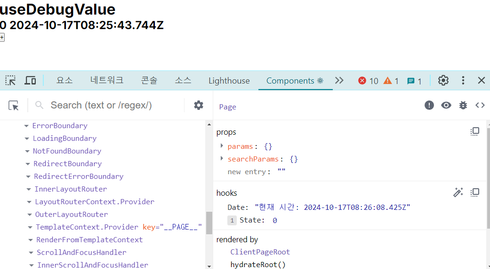

# 목차

- 3.1 [리액트의 모든 훅 파헤치기](#리액트의-모든-훅-파헤치기)
- 3.2 [사용자 정의 훅과 고차 컴포넌트 중 무엇을 써야 할까?](#사용자-정의-훅과-고차-컴포넌트-중-무엇을-써야-할까)

# 리액트의 모든 훅 파헤치기

## useState

함수 컴포넌트 내부에서 상태를 정의하고, 이 상태를 관리할 수 있게 해주는 훅이다.

사용법

```tsx
import { useState } from "react";

const [state, setState] = useState(initialState);
```

### useState 내부 구조

```jsx
// useState의 내부 구조를 흉내 낸 코드
const MyReact = (function () {
  const global = {};
  let index = 0;

  function useState(initialState) {
    if (!global.states) {
      // 애플리케이션 전체의 states 배열을 초기화 한다.
      // 최초 접근이라면 빈 배열로 초기화한다.
      global.states = [];
    }

    // states 정보를 조회해서 현재 상태값이 있는지 확인하고,
    // 없다면 초기값으로 설정한다.
    const currentState = global.states[index] || initialState;
    // states의 값을 위에서 조회한 현재 값으로 업데이트한다.
    global.states[index] = currentState;

    // 즉시 실행 함수로 setter를 만든다.
    const setState = (function () {
      // 현재 index를 클로저로 가둬놔서 이후에도 계속해서 동일한 index에
      // 접근할 수 있도록 한다.
      let currentIndex = index;
      return function (value) {
        global.states[currentIndex] = value;
        // 컴포넌트를 렌더링한다. 실제로 컴포넌트를 렌더링하는 코드는 생략했다.
      };
    })();
    // useState를 쓸 때마다 index를 하나씩 추가한다. 이 index는 setState에서 사용된다.
    // 즉, 하나의 state마다 index가 할당돼 있어 그 index가 배열의 값(global.states)을
    // 가리키고 필요할 때마다 그 값을 가져오게 한다.
    index = index + 1;

    return [currentState, setState];
  }

  // 실제 useState를 사용하는 컴포넌트
  function Component() {
    const [Value, setValue] = useState(0);
    // ...
  }
})();
```

- 클로저를 활용하여 구현함

### 게으른 초기화(lazy initialization)

- 게으른 초기화는 useState의 기본 값으로 함수를 인수로 넣어주는 최적화 방법이다.
- 원시 값뿐만 아니라 특정한 값을 반환하는 함수를 인수로 넣을 수도 있다.
- [공식문서](https://ko.legacy.reactjs.org/docs/hooks-reference.html#lazy-initial-state)에 따르면 초기 값이 복잡하거나 무거운 연산을 포함할 때 사용을 권장한다.

```jsx
// 일반적인 useState 사용
// 바로 함수를 집어넣는다.
const [count, setCount] = useState(
  Number.parseInt(window.localStorage.getItem(cacheKey))
);

// 게으른 초기화
// 위 코드와의 차이점은 함수를 실행해 값을 반환한다는 것이다.
const [count, setCount] = useState(() => {
  Number.parseInt(window.localStorage.getItem(cacheKey));
});
```

- useState의 기본 값으로 함수를 넘겨줄 경우, 매 랜더링마다 연산을 다시 하게 된다.
- 게으른 초기화를 사용하면 첫 렌더링 시에만 연산을 하고 이후 렌더링에서는 연산된 결과를 메모해서 사용하게 된다.
- 이렇게 하면 초기 렌더링 시에만 무거운 연산이 실행되므로 성능을 최적화할 수 있다.

## useEffect

애플리케이션 내 컴포넌트의 여러 값들을 활용해 동기적으로 부수 효과를 만드는 메커니즘이다. 그리고 이 부수 효과가 `언제` 일어나는지 보다 어떤 상태 값과 실행되는지 살펴 보는 것이 중요하다.

### 형태

```jsx
function Component() {
  // ...
  useEffect(() => {
    // do something
  }, [props, state]);
}
```

- 첫 번째 인수로는 실행할 부수 효과가 포함된 함수
- 두 번째 인수로는 의존성 배열을 전달
  - 값을 가진 배열
  - 빈 배열
  - 아무 값도 안 넣을 수 도 있다.

### 동작

- 함수 컴포넌트는 렌더링할 때 마다 고유의 state와 props 값을 가지게 된다.
- useEffect는 특별한 기능을 통해 값의 변화를 확인하는게 아님
  - 렌더링 시 마다 의존성에 있는 값을 보면서 이전과 다른게 하나라도 있으면 부수 효과를 실행하는 평범한 함수이다.

### 클린업 함수의 목적

- useEffect의 콜백 함수 부분에 return 값으로 클린업 함수를 반환할 수 있다.
- 클린업 함수는 렌더링 이후 실행되지만, 함수가 선언됐던 환경을 기준으로 실행된다.
  - 즉, 렌더링으로 인해 변경된 값을 읽지 못한다.
- useEffect는 콜백이 실행될 때마다 이전의 클린업 함수가 존재하면 그 클린업 함수를 실행한 후에 콜백을 실행한다.
  - 따라서 이전 이벤트를 지우는 코드를 클린업 함수에 추가하는 것이다.
- 생명주기 메서드의 언마운트와는 조금 다른 개념이다.
  - 언마운트는 특정 컴포넌트가 DOM에서 사라지는 것을 의미한다.
  - 클린업 함수는 컴포넌트가 리렌더링될 때, 의존성 변화가 있었던 당시의 이전 값을 기준으로 실행되며, 말 그대로 이전 상태를 청소해 주는 개념이다.

```tsx
useEffect(() => {
  const handleScroll = () => {
    console.log("scrolling");
  };

  window.addEventListener("scroll", handleScroll);

  // 클린업 함수
  return () => {
    window.removeEventListener("scroll", handleScroll);
  };
}, []); // 의존성 배열에 빈 배열을 넣으면 컴포넌트가 언마운트될 때 클린업 함수가 실행된다.
```

## 의존성 배열

의존성 배열은 보통 세 가지로 나뉜다.

- 빈 배열
  - 비교할 의존성이 없다고 판단하여 최초 렌더링 직후에는 더 이상 콜백 함수를 실행하지 않음.
- 아무런 값도 넘기지 않기

  - 의존성을 비교할 필요 없이 렌더링할 때마다 콜백 함수를 실행.
  - 보통 컴포넌트가 렌더링됐는지 확인하기 위한 방법으로 사용.

    ```tsx
    tsx
    코드 복사
    // 컴포넌트 렌더링 여부를 확인할 수 있다.
    useEffect(() => {
        console.log("컴포넌트 렌더링됨");
    });

    ```

  - 매 렌더링마다 실행된다면 useEffect를 안 써도 되는 거 아님?
    - 서버 사이드 렌더링 관점에서는 useEffect는 클라이언트 사이드에서 실행되는 것을 보장해줌.
    - useEffect는 컴포넌트 렌더링의 부수 효과, 즉 컴포넌트의 렌더링이 완료된 이후에 실행됨. 반면 함수 내부에서 직접 실행하는 경우에는 컴포넌트가 렌더링되는 도중에 실행됨.
    - 즉, 서버 사이드에서 렌더링할 경우 직접 실행한 코드는 서버에서도 실행됨. 이는 함수 컴포넌트 반환을 지연시키는 행위를 하게 됨. 무거운 작업을 실행할 경우 렌더링을 방해해서 성능에 악영향을 줄 수 있음.

- 사용자가 직접 원하는 값
  - 값이 변경되었을 때 콜백 함수를 실행.

## useEffect의 내부 구조

```tsx
const MyReact = (function () {
  const global = {};
  let index = 0;

  function useEffect(callback, dependencies) {
    const hooks = global.hooks;

    // 이전 훅 정보가 있는지 확인한다.
    let previousDependencies = hooks[index];

    // 변경됐는지 확인
    // 이전 값이 있다면 이전 값을 얕은 비교로 비교해 변경이 일어났는지 확인한다.
    // 이전 값이 없다면 최초 실행이므로 변경이 일어난 것으로 간주해 실행을 유도한다.
    let isDependeciesChanged = previousDependecies
      ? dependencies.some(
          (value, idx) => !Object.is(value, previousDependencies[idx])
        )
      : true;

    // 변경이 일어났다면 첫 번째 인수인 콜백 함수를 실행한다.
    if (isDependeciesChanged) {
      callback();

      // 다음 훅이 일어날 때를 대비하기 위해 index를 추가한다.
      idex++;

      // 현재 의존성을 훅에 다시 저장한다.
      hooks[index] = dependencies;
    }

    return { useEffect };
  }
})();
```

- 핵심은 의존성 배열의 이전 값과 현재 값의 얕은 비교이다.
  - 이때 `Object.is`를 기반으로 하는 얕은 비교를 수행
- 이전 의존성 배열과 현재 의존성 배열의 값에 하나라도 변경 사항이 있다면 callback을 선언한 부수 효과를 실행

## useEffect 사용 시 주의할 점

잘못 사용할 시 예기치 못한 버그가 발생할 수 있고, 심한 경우 무한 루프에 빠지기도 한다.

### `eslint-disable-line react-hooks/exhaustive-deps` 주석은 최대한 자제하기

- `react-hooks/exhaustive-deps` 룰을 무시하겠다는 주석이다.
  - 이 룰은 useEffect 인수 내부에서 사용하는 값 중 의존성 배열에 포함되지 않은 값이 있을 때 경고를 발생시킨다.
- 해당 주석을 사용하는 대부분의 경우는 의존성 배열에 빈 배열 `[]`을 넣을 때이다. 이는 “컴포넌트 마운트 시점에만 무언가를 하고 싶다”라는 의도로 작성된다.
  - 이는 클래스 컴포넌트의 생명주기에 기반한 접근법으로, 가급적이면 사용을 자제해야 한다.
- useEffect 내부에서 사용한 값을 의존성 배열에 넣지 않는다는 것은, 이 부수 효과가 실제로 관찰하고 실행해야 하는 값과 별개로 작동한다는 의미이다.
  - 컴포넌트의 state, props와 같은 값의 변경과 useEffect의 연결 고리가 끊어지게 된다.
  - 이는 당장 문제가 없더라도 향후 잠재적인 버그의 위험성을 내포하고 있다.
- useEffect에 빈 배열을 넘기기 전에는 정말로 useEffect의 부수 효과가 컴포넌트의 상태와 별개로 작동해야만 하는지, 혹은 여기서 호출하는 것이 최선인지 면밀히 검토해야 한다.
- 빈 배열이 아닐 때도 마찬가지이다.
  - 특정 값을 사용하지만 해당 값의 변경 시점을 피할 목적이라면 메모이제이션을 적절히 활용해 해당 값의 변화를 막거나 적당한 실행 위치를 다시 한번 고민해 보는 것이 좋다.

### useEffect의 첫 번째 인수에 함수명을 부여하라

- 보통 useEffect를 사용하는 많은 코드와 공식 문서에서 useEffect의 첫 번째 인수로 익명 함수를 넘겨준다.
  ```tsx
  useEffect(() => {
    logging(user.id);
  }, [user.id]);
  ```
  - useEffect의 수가 적거나 복잡성이 낮다면 큰 문제는 없다.
  - 코드가 복잡해지고 useEffect의 수가 많아진다면 useEffect의 목적을 파악하기 어려워진다.
- useEffect의 첫 번째 인수에 함수명을 부여하는 것이 useEffect의 목적을 파악하기 용이하다.
  ```tsx
  useEffect(
    function logActiveUser() {
      logging(user.id);
    },
    [user.id]
  );
  ```

### 거대한 useEffect를 만들지 마라

- useEffect는 의존성이 변경될 때마다 부수 효과를 실행한다.
- 부수 효과의 크기가 커질수록 애플리케이션 성능에 악영향을 끼친다.
- useEffect가 커질 것 같다면 의존성 배열을 쪼개서 여러 개의 useEffect를 만드는 것이 좋다.
- 의존성 배열이 복잡해질수록 useEffect가 언제 발생하는지 알 수 없어진다.
- 만약 부득이하게 useEffect를 크게 유지해야 한다면 최대한 useCallback과 useMemo 등으로 사전에 정제한 내용들만 담아 두는 게 좋다.

### 불필요한 외부 함수를 만들지 마라

- useEffect의 크기가 작아야 하는 것과 같은 맥락으로, useEffect가 실행하는 콜백 또한 불필요하게 존재하면 안 된다.

  ```tsx
  function Component({ id }: { id: string }) {
    const [info, setInfo] = useState<number | null>(null);
    const controllerRef = useRef<AbortController | null>(null);
    const fetchInformation = useCallback(async (fetchId: string) => {
      controllerRef.current?.abort();
      controllerRef.current = new AbortController();

      const result = await fetchInfo(fetchId, {
        signal: controllerRef.current.signal,
      });
      setInfo(await result.json());
    }, []);

    useEffect(() => {
      fetchInformation(id);
      return () => controllerRef.current?.abort();
    }, [id, fetchInformation]);
    return <div>{/* 렌더링 */}</div>;
  }
  ```

  - 위 컴포넌트는 props를 받아서 그 정보를 바탕으로 API 호출을 하는 useEffect를 가지고 있다.
  - 그러나 useEffect 밖에서 함수를 선언하다 보니 불필요한 코드가 많아지고 가독성이 떨어졌다.

  ```tsx
  function Component({ id }: { id: string }) {
    const [info, setInfo] = useState<number | null>(null);

    useEffect(() => {
      const controller = new AbortController()(async () => {
        const result = await fetchInfo(id, { signal: controller.signal });
        setInfo(await result.json());
      })();

      return () => controller.abort();
    }, [id]);
    return <div>{/* 렌더링 */}</div>;
  }
  ```

  - useEffect 외부에 있던 관련 함수를 내부로 가져왔더니 훨씬 간결해졌다.
  - 의존성 배열 또한 줄일 수 있었다.
  - 무한 루프에 빠지지 않기 위해 넣었던 useCallback도 삭제할 수 있었다.
  - useEffect에서 사용할 부수 효과라면 내부에서 정의해서 사용하는 것이 좋다.

## useMemo

비용이 큰 연산에 대한 결과를 저장(메모이제이션)해 두고, 이 저장된 값을 반환하는 훅이다.

### 사용법

```tsx
import { useMemo } from "react";

const memoizedValue = useMemo(() => expensiveComputation(a, b), [a, b]);
```

- 첫 번째 인수로는 어떠한 값을 반환하는 생성 함수
- 두 번째 인수로는 해당 함수가 의존하는 값의 배열
- 렌더링 발생 시 의존성 배열 값이 변경되지 않았다면 함수를 재실행하지 않고 이전에 계산해둔 결과 값을 기억해 반환해 준다.
- 의존성 배열이 변경됐다면 새로운 값으로 함수를 다시 계산해 값을 반환하고 기억해둔다.

### useMemo를 사용한 컴포넌트 메모이제이션

- 컴포넌트를 반환하는 함수를 만들어서 메모 할 수 있다.

  ```tsx
  function ExpensiveComponent({ value }) {
    useEffect(() => {
      console.log("rendering!");
    });
    return <span>{value + 1000}</span>;
  }

  function App() {
    const MemoizedComponent = useMemo(
      () => <ExpensiveComponent value={value} />,
      [value]
    );

    // ...
    return <>{MemoizedComponent}</>;
  }
  ```

- 위처럼 사용할 수는 있으나 React.memo를 쓰는 것이 더 현명하다.

## useCallback

useCallback은 인수로 넘겨 받은 콜백 자체를 기억하여, 특정 함수를 새로 만들지 않고 다시 재사용하는 훅이다.

```tsx
const toggle = useCallback(
  function toggle() {
    setState(!state);
  },
  [state]
);
```

### 왜 사용해야 할까?

React.memo를 사용하여 컴포넌트를 메모할 경우, props가 변경되지 않는다면 컴포넌트의 렌더링이 발생하지 않는다. 여기서 props로 함수를 받을 경우 문제가 발생한다. props로 전달된 함수를 생성한 상위 컴포넌트가 리렌더링될 때마다 함수 자체가 재생성된다. 즉, 함수가 재생성되면서 참조하는 주소가 바뀌기 때문에 props가 변경된 것으로 인식해 메모된 컴포넌트가 리렌더링되는 현상이 발생하게 된다. 이때 전달되는 함수를 생성할 때 useCallback을 사용하면 해결할 수 있다.

### useCallback의 내부 구조

기본적으로 useCallback은 useMemo를 사용해 구현할 수 있다. 이는 Preact에서도 리액트 공식문서에서도 확인할 수 있다.

```tsx
export function useCallback(callback, args) {
  currentHook = 8;
  return useMemo(() => callback, args);
}
```

- useMemo와 useCallback의 유일한 차이는 메모이제이션의 대상이 변수냐 함수냐일 뿐이다.
- 다만 useMemo로 useCallback을 구현하면 불필요하게 코드가 길어지고 혼동을 야기할 수 있기 때문에 리액트에서 useCallback을 따로 제공해 주는 것으로 추측된다.

## useRef

useRef는 useState와 동일하게 컴포넌트 내부에서 렌더링이 일어나도 변경 가능한 상태 값을 저장한다는 공통점이 있다. 그러나 useState와는 구별되는 큰 차이점 두 가지를 가지고 있다.

- useRef는 반환 값인 객체 내부에 있는 current로 값에 접근 또는 변경할 수 있다.
- useRef는 그 값이 변하더라도 렌더링을 발생 시키지 않는다.

### useRef가 왜 필요할까?

**렌더링에 영향 안주는 고정된 값이라면 함수 외부에서 값을 선언해서 관리해버리면 안됨?**

- 컴포넌트가 렌더링 되지 않아도 외부에 값이 존재해서 메모리를 차지하게 됨
- 만약 컴포넌트를 여러번 생성한다 해도 각 컴포넌트에서 가리키는 값이 동일한 문제가 있음

**useRef는 위의 두 가지 문제를 모두 극복할 수 있는 리액트식 접근법이다.**

- 컴포넌트가 렌더링될 때만 생성된다.
- 컴포넌트 인스턴스가 여러 개라도 각각 개별의 값을 바라본다.

### useRef 사용법

가장 일반적인 사용법은 DOM에 접근하고 싶을 때이다.

```tsx
function RefComponent() {
  const inputRef = useRef();

  // 이때는 미처 렌더링이 실행되기 전(반환되기 전)이므로 undefined를 반환한다.
  console.log(inputRef.current); // undefined

  useEffect(() => {
    console.log(inputRef.current); // <input type="text"></input>
  }, [inputRef]);

  return <input ref={inputRef} type="text" />;
}
```

- 최초로 넘겨받은 기본 값을 가지고 있다.
  - useRef의 최초 값은 ref를 할당한 DOM 요소가 아닌 넘겨받은 인수이다.

### 응용법

렌더링을 발생시키지 않고 원하는 상태값을 저장할 수 있다는 특징을 활용

```tsx
function usePrevious(value) {
  const ref = useRef();
  useEffect(() => {
    ref.current = value;
  }, [value]); // value가 변경되면 그 값을 ref에 넣어둔다.
  return ref.current;
}

function SomeComponent() {
  const [counter, setCounter] = useState(0);
  const previousCounter = usePrevious(counter);

  function handleClick() {
    setCounter((prev) => prev + 1);
  }

  // 0 (undefined)
  // 1, 0
  // 2, 1
  // 3, 2
  return (
    <button onClick={handleClick}>
      {counter} {previousCounter}
    </button>
  );
}
```

- `const previousCounter = usePrevious(counter)` 코드는 렌더링 과정에서 커밋 이전에 실행되기 때문에 이전의 `ref.current` 값을 가져오게 된다.
- 실제로 변경된 `counter` 값이 `ref.current`에 반영되는 시기는 커밋 이후이기 때문에, 이 시점에 새로운 값으로 `ref.current`가 바뀌게 된다.

### useRef의 내부 구조

```tsx
export function useRef(initialValue) {
  currentHook = 5;
  return useMemo(() => ({ current: initialValue }), []);
}
```

- 값이 변경되어도 렌더링이 발생하면 안 되기 때문에 의존성 배열을 빈 배열로 설정하여 `useMemo`가 첫 렌더링에서만 실행되도록 함.
- 객체의 값을 변경해도 객체의 주소는 달라지지 않는 점을 이용하여 `ref` 객체의 속성을 직접 수정하는 방식으로 동작.

## useContext

useContext에 대해 이해하려면 먼저 리액트의 Context에 대해 알아야 한다.

### Context란?

- 리액트는 기본적으로 부모 컴포넌트와 자식 컴포넌트로 이뤄진 트리 구조를 가짐
- 부모 컴포넌트의 데이터를 자식이 사용하려면 props를 통해 넘겨준다.
  - 트리의 구조가 커질수록 drilling이 심해지고 불편해진다.
- 이를 해결하기 위해 등장한 개념이 콘텍스트(Context)이다.

### Context를 함수 컴포넌트에서 사용할 수 있게 해주는 useContext 훅

```tsx
const Context = createContext<{ hello: string } | undefined>(undefined);

function ParentComponent() {
  return (
    <>
      <Context.Provider value={{ hello: "react" }}>
        <Context.Provider value={{ hello: "javascript" }}>
          <ChildComponent />
        </Context.Provider>
      </Context.Provider>
    </>
  );
}

function ChildComponent() {
  const value = useContext(Context);

  // react가 아닌 javascript가 반환된다.
  return <>{value ? value.hello : ""}</>;
}
```

- useContext는 상위 컴포넌트에서 만들어진 Context를 함수 컴포넌트에서 사용할 수 있게 한다.
- 상위 컴포넌트에서 선언된 `<Context.Provider />`에서 제공한 값을 사용할 수 있다.
- 만약 Provider가 여러 개라면 가장 가까운 Provider의 값을 가져오게 된다.

### 다수의 Provider 사용 시 안정성 높이기

컴포넌트의 트리가 복잡해지고 context가 많아질수록 원하는 값이 존재하지 않아 오류가 발생할 가능성이 생긴다.

```tsx
function useMyContext() {
  const context = useContext(MyContext);
  if (context === undefined) {
    throw new Error(
      "useMyContext는 ContextProvider 내부에서만 사용할 수 있습니다."
    );
  }
  return context;
}

function ChildComponent() {
  // 타입이 명확히 설정돼 있어서 굳이 undefined 체크를 하지 않아도 된다.
  // 이 컴포넌트가 Provider 하위에 없다면 에러가 발생할 것이다.
  const { hello } = useMyContext();

  return <>{hello}</>;
}
```

- 별도의 함수로 감싸 에러 처리를 하였다.
  - 타입 추론에 유용하다.
  - 상위에 Provider가 없는 경우에도 사전에 쉽게 에러를 감지할 수 있다.

### useContext를 사용할 때 주의할 점

- 컴포넌트 내부에 useContext를 사용할 경우 재활용이 어려워진다.
  - useContext가 선언되어 있으면 Provider에 의존성을 가져 아무데서나 재사용할 수 없다.
  - Provider 내부에서 사용하지 않을 경우 예기치 못한 작동 방식이 만들어진다.
  - useContext를 사용하는 컴포넌트를 최대한 작게 하거나 재사용하지 않아야 한다.
- Provider 내부의 컴포넌트는 Provider가 리렌더링 되면 하위의 모든 컴포넌트가 같이 리렌더링 된다.
  - 리렌더하고 싶지 않은 하위 컴포넌트에 React.Memo를 사용하여 해결 가능하다.

## useReducer

useState와 비슷한 형태를 띠지만 좀 더 복잡한 상태 값을 미리 정의해 놓은 시나리오 따라 관리할 수 있는 useState의 심화 버전이라 볼 수 있다.

### 특징

- 반환 값은 useState와 동일하게 길이가 2인 배열이다. `[state, dispatcher]`
  - `state`: 현재 useReducer가 가지고 있는 값
  - `dispatcher`: state를 업데이트하는 함수. setState가 단순히 값을 넘겨준다면 여기는 state를 변경할 수 있는 action을 넘겨준다.
- useState의 인수와 달리 2~3개의 인수가 필요. `useReducer(reducer, initialState, init)`
  - `reducer`: useReducer의 기본 aciton을 정의하는 함수
  - `initialState`: useReducer의 초깃값
  - `init`: useState의 게으른 초기화처럼 사용하기 위한 함수(필수는 아니다). `init`이 존재한다면 useState와 동일하게 게으른 초기화가 일어나며 `initialState`를 인수로 `init` 함수가 실행된다.

### 사용법

```tsx
// useReducer가 사용할 state를 정의
type State = {
  count: number;
};

// state의 변화를 발생시킬 action의 타입과 넘겨줄 값(payload)을 정의
// 꼭 type과 payload라는 네이밍을 지킬 필요도 없으며, 굳이 객체일 필요도 없다.
// 다만 이러한 네이밍이 가장 널리 쓰인다.
type Action = {
  type: "up" | "down" | "reset";
  payload?: State;
};

// 무거운 연산이 포함된 게으를 초기화 함수
function init(count: State): State {
  // count: State를 받아서 초깃을 어떻게 정의할지 연산하면 된다.
  return count;
}

// 초깃값
const initialState: State = { count: 0 };

// 앞서 선언한 state와 action을 기반으로 state가 어떻게 변경될지 정의
function reducer(state: State, action: Action): State {
  switch (action.type) {
    case "up":
      return { count: state.count + 1 };
    case "down":
      return { count: state.count - 1 > 0 ? state.count - 1 : 0 };
    case "reset":
      return init(action.payload || { count: 0 });
    default:
      throw new Error(`Unexpected action type ${action.type}`);
  }
}

export default function App() {
  const [state, dispatcher] = useReducer(reducer, initialState, init);

  function handleUpButtonClick() {
    dispatcher({ type: "up" });
  }

  function handleDownButtonClick() {
    dispatcher({ type: "down" });
  }

  function handleResetButtonClick() {
    dispatcher({ type: "reset", payload: { count: 1 } });
  }

  return (
    <div className="App">
      <h1>{state.count}</h1>
      <button onClick={handleUpButtonClick}>+</button>
      <button onClick={handleDownButtonClick}>-</button>
      <button onClick={handleResetButtonClick}>reset</button>
    </div>
  );
}
```

- 복잡한 형태의 state를 사전에 정의된 dispatcher로만 수정할 수 있게 만들어 준다.
  - state 값을 변경하는 시나리오를 제한적으로 두고 변경을 빠르게 확인하는 것이 목적
- state를 사용하는 로직과 state를 관리하는 비지니스 로직을 분리할 수 있다.

### useState와 useReducer의 차이

```tsx
// Preact가 구현한 useState

export function useState(initialState) {
  currentHook = 1;
  return useReducer(invokeOrReturn, initialState);
}
```

Preact의 useState 코드를 살펴보면 useReducer로 구현돼 있는 것을 알 수 있다.

이와 반대로 useReducer를 useState로 구현 할 수도 있다.

```tsx
const useReducer = (reducer, initialArg, init) => {
  const [state, setState] = useState(
    // 초기화 함수가 있으면 초깃값과 초기화 함수를 실행하고,
    // 그렇지 않으면 초깃값을 넣는다.
    init ? () => init(initialArg) : initailArg
  );

  // 값을 업데이트하는 dispatch를 넣어준다.
  const dispatch = useCallback(
    (action) => setState((prev) => reducer(prev, action)),
    [reducer]
  );

  // 이 값을 메모이제이션한다.
  return useMemo(() => [state, dispatch], [state, dispatch]);
};
```

즉, useReducer나 useState 둘 다 세부 작동과 쓰임에만 차이가 있을 뿐, 결국 클로저를 활용해 값을 가둬서 state를 관리한다는 사실에는 변함이 없다.

## useImperativeHandle

useImperativeHandle은 실제 개발 과정에서는 자주 볼 수 없는 훅으로 널리 사용되지 않는다. 그럼헤도 일부 사용 사례에서 유용하게 활용될 수 있다. useImperativeHandle를 이해하기 위해서는 먼저 React.forwardRef에 대해 알아야한다.

### `forwardRef` 살펴보기

`ref`는 `useRef`에서 반환한 객체로, React에서는 `HTMLElement`에 접근하는 용도로 흔히 사용된다. 만약 기존 지식으로 `ref`를 하위 컴포넌트에 전달하고 싶다면 어떻게 해야 할까?

**하위 컴포넌트에 `ref` 전달하기**

1. **`ref`라는 이름의 예약어로 props 전달하기**

   ```tsx
   <ChildComponent ref={inputRef} />
   ```

   이 경우, `ref`는 props로 사용할 수 없다는 경고문과 함께 `undefined`를 반환한다.

2. **예약어인 `ref`가 아닌 다른 props로 전달하기**

   ```tsx
   <ChildComponent parentRef={inputRef} />
   ```

   앞선 방법과 다르게 잘 동작하는 것으로 보인다.

위의 방법 말고도 `forwardRef`를 사용하는 방법을 알아보자.

기본적으로 `forwardRef`는 예약어인 `ref`가 아닌 다른 props로 전달하기 방식과 동일한 작업을 하는 React API이다. 그런데 단순히 이렇게 props로 구현할 수 있는 것을 왜 만든 것일까?

이유는 `ref`를 전달함에 있어서 일관성을 제공하기 위해서다. 어떤 props명으로 전달할지 모르고, 이에 대한 완전한 네이밍의 자유가 주어진 props보다는 `forwardRef`를 사용하면 좀 더 확실하게 `ref`를 전달할 것임을 예측할 수 있고, 또 사용하는 쪽에서도 확실히 안정적으로 받아서 사용할 수 있다. `forwardRef`를 사용하는 다음 예제를 보자.

```tsx
const ChildComponent = forwardRef((props, ref) => {
  useEffect(() => {
    // {current: undefined}
    // {current: HTMLInputElement}
    console.log(ref);
  }, [ref]);

  return <div>안녕</div>;
});

function ParentComponent() {
  const inputRef = useRef();

  return (
    <>
      <input ref={inputRef} />
      <ChildComponent ref={inputRef} />
    </>
  );
}
```

- `ref`를 받고자 하는 컴포넌트를 `forwardRef`로 감싸고, 두 번째 인수로 `ref`를 전달 받는다.
- 부모 컴포넌트에서는 동일하게 `ref`를 통해 `ref`를 넘겨주면 된다.
- 이렇게 `forwardRef`를 사용하는 코드로 수정하면 `ref`를 props로 전달할 수 있고, 전달받은 컴포넌트에서도 `ref`라는 이름을 그대로 사용할 수 있다.

### useImperativeHandle이란?

useImperativeHandle은 부모한테 넘겨받은 ref를 원하는 대로 수정할 수 있는 훅이다.

```tsx
const Input = forwardRef((props, ref) => {
  // useImperativeHandle을 사용하면 ref의 동작을 추가로 정의할 수 있다.
  useImperativeHandle(
    ref,
    () => ({
      alert: () => alert(props.value),
    }),
    // useEffect의 deps와 같다.
    [props.valuse]
  );

  return <input ref={ref} {...props} />;
});

function App() {
  // input에 사용할 ref
  const inputRef = useRef();
  // input의 value
  const [text, setText] = useState("");

  function handleClick() {
    // inputRef에 추가한 alert라는 동작을 사용할 수 있다.
    inputRef.current.alert();
  }

  function handleChange(e) {
    setText(e.target.value);
  }

  return (
    <>
      <Input ref={inputRef} value={text} onChange={handleChange} />
      <button onClick={handleClick}>Focus</button>
    </>
  );
}
```

- `useImperativeHandle`을 사용하여 `ref`가 부모 컴포넌트에 노출할 수 있는 메서드를 정의했다
  - 부모 컴포넌트는 `Input` 컴포넌트에서 전달 받은 `inputRef`에서 `alert`이라는 동작을 실행 할 수 있게 됬다.
- 기존의 `ref`는 `{current: <HTMLElement>}` 와 같은 형태로 HTMLElement만 주입할 수 있었는데 `useImperativeHandle` 를 통해 새로운 동작을 정의할 수 있다.

## `useLayoutEffect`

공식 문서에 따르면 `useLayoutEffect`는 다음과 같이 정의하고 있다.

> 이 함수의 시그니처는 useEffect와 동일하나, 모든 DOM의 변경 후에 동기적으로 발생한다.

### `useEffect`와의 비교

### 함수의 시그니처가 `useEffect`와 동일

- 두 훅의 형태나 사용 예제가 동일하다는 것을 의미
  - `useEffect`와 동일하게 사용하면 된다.

### 모든 DOM의 변경 후에 동기적으로 발생

우선, DOM의 변경이란 렌더링을 의미하며, 브라우저에 실제로 해당 변경 사항이 반영되는 시점을 의미하는 것은 아니다. 즉, 실행 순서는 다음과 같다.

1. React가 DOM을 업데이트
2. `useLayoutEffect`를 실행
3. 브라우저에 변경 사항을 반영
4. `useEffect`를 실행

이를 통해 알 수 있는 것은 다음과 같다.

- `useLayoutEffect`는 `useEffect`보다 먼저 실행된다.
- 동기로 동작하기 때문에 `useLayoutEffect`의 실행이 끝나기 전까지 컴포넌트가 일시 정지하게 된다.
  - 따라서 성능상의 문제가 발생할 수 있다.

그렇다면 언제 사용하는 것이 좋을까?

- DOM은 계산됐지만 이것이 화면에 반영되기 전에 하고 싶은 작업이 있을 때와 같이 반드시 필요할 때만 사용하자.
  - 특정 DOM 요소를 기반으로 한 애니메이션
  - 스크롤 위치 제어

## useDebugValue

일반적으로 프로덕션 웹서비스에서 사용하는 훅이 아니라 개발 과정에서 디버깅하고 싶은 정보가 있을때 사용는 훅이다.

```tsx
// 현재 시간을 정의하는 사용자 정의 훅
function useDate() {
  const date = new Date();
  // useDeugValue롤 디버깅 정보를 기록
  useDebugValue(date, (date) => `현재 시간: ${date.toISOString()}`);

  return date;
}

export default function Page() {
  const date = useDate();
  const [counter, setCounter] = useState(0); // 렌더링을 발생시키기 위한 변수

  function handleClick() {
    setCounter((prev) => prev + 1);
  }

  return (
    <>
      <h1>useDebugValue</h1>
      <h2>
        {counter} {date.toISOString()}
      </h2>
      <button onClick={handleClick} type="button">
        +
      </button>
    </>
  );
}
```

위 코드를 실행한 다음, react 개발자 도구로 확인하면 다음과 같은 결과를 볼 수 있다.



- `useDebugValue`는 사용자 정의 훅 내부의 내용에 대한 정보를 남길 수 있다.
- 두 번째 인수로 포매팅 함수를 전달하면 이에 대한 값이 변경됐을 때만 호출된다.
- 오직 다른 훅 내부에서만 실행할 수 있다.
  - 컴포넌트 레벨에서는 작동 x
- 공통 훅을 제공하는 라이브러리나 대규모 웹 애플리케이션에서 디버깅을 제공할 때 유용하게 사용 가능하다.

## 훅의 규칙(eules-of-hooks)

### 1. 최상위에서만 훅을 호출해야 한다.

- 반복문이나 조건문, 중첩된 함수 내에서 훅을 실행할 수 없다. (19 버전에 나온 use 훅은 예외)
- 이 규칙을 따라야만 컴포넌트의 렌더링 순서를 보장 할 수 있다.

### 2. 훅을 호출 할 수 있는 것은 react 함수 컴포넌트, 혹은 사용자 정의 훅 두가지 뿐이다.

- 일반 자바스크립트 함수에서는 훅을 사용할 수 없다.

# 사용자 정의 훅과 고차 컴포넌트 중 무엇을 써야 할까?

## 사용자 정의 훅

- 서로 다른 컴포넌트 내부에서 같은 로직을 공유하고자 할 때 주로 사용한다.
- 기존 훅을 기반으로 개발자가 필요한 훅을 만드는 방법이다.
- 훅의 이름을 use로 시작해야 하는 규칙이 있다.
  - 일반적인 함수들과 확실하게 구분하기 위함이다.

### 예제

```tsx
// fetch를 수행하는 useFetch 예제와 실제 사용 예제
import { useEffect, useState } from "react";

// HTTPS 요청을 하는 사용자 정의 훅
function useFetch<T>(
  url: string,
  { method, body }: { method: string; body?: XMLHttpRequestBodyInit }
) {
  // 응답 결과
  const [result, setResult] = useState<T | undefined>();
  // 요청 중 여부
  const [isLoading, setIsLoading] = useState<boolean>(false);
  // 2xx 3xx로 정상 응답인지 여부
  const [ok, setOk] = useState<boolean | undefined>();
  // HTTP status
  const [status, setStatus] = useState<number | undefined>();

  useEffect(() => {
    const abortController = new AbortController();

    async () => {
      setIsLoading(true);

      const response = await fetch(url, {
        method,
        body,
        signal: abortController.signal,
      });

      setOk(response.ok);
      setStatus(response.status);

      if (response.ok) {
        const apiResult = await response.json();
        setResult(apiResult);
      }
    };

    setIsLoading(false);

    return () => {
      abortController.abort();
    };
  }, [url, method, body]);

  return { ok, result, isLoading, status };
}

interface Todo {
  userId: number;
  id: number;
  title: string;
  completed: boolean;
}

export default function Page() {
  // 사용자 지정 훅 사용
  const { ok, result, isLoading, status } = useFetch<Array<Todo>>(
    "https://jsonplaceholder.typicode.com/todos",
    {
      method: "GET",
    }
  );

  useEffect(() => {
    if (!isLoading) {
      console.log("fetchResult >>", status);
    }
  }, [status, isLoading]);

  return (
    <div>
      {ok
        ? (result || []).map(({ userId, title }) => (
            <div key={userId}>
              <p>{userId}</p>
              <p>{title}</p>
            </div>
          ))
        : null}
    </div>
  );
}
```

이 코드는 fetch를 이용해 API를 호출하는 로직을 사용자 정의 훅으로 분리한 예제이다. 만약 훅으로 분리하지 않았다면 fetch로 API 호출을 해야하는 컴포넌트들에서 최소 4개의 state를 선언해서 각각 구현해야 할 것이다. 사용자 정의 훅을 사용하면 이런 복잡한 로직을 간단하게 만들 수 있다.

## 고차 컴포넌트(HOC, Higher Order Component)

- 컴포넌트 자체의 로직을 재사용하기 위한 방법이다.
- 고차 함수의 일종으로, 자바스크립트의 일급 객체, 함수의 특징을 이용한다.
  - React 외에도 사용 가능하다.

### React.memo

- 부모 컴포넌트가 리렌더링되면 자식 컴포넌트도 리렌더링된다.
  - 이는 props의 변경 여부와 관계없이 발생한다.
- `react.memo`로 컴포넌트를 감싸면 props가 변하지 않는 한 리렌더링되지 않는다.
  - 이전에 기억한 컴포넌트를 그대로 반환한다.
- `useMemo`를 통해서도 동일한 메모이제이션이 가능하지만, 일반적인 사용법과는 다르기 때문에 가독성을 위해 `react.memo` 사용을 권장한다.

**사용법**

```tsx
const ChildComponent = memo(({ value }: { value: string }) => {
  useEffect(() => {
    console.log("렌더링!");
  }, []);

  return <>안녕하세요! {value}</>;
});

export default function ParentComponent() {
  const [state, setState] = useState(1);

  function handleChange(e: ChangeEvent<HTMLInputElement>) {
    setState(Number(e.target.value));
  }

  return (
    <>
      <input type="number" value={state} onChange={handleChange} />
      <ChildComponent value="hello" />
    </>
  );
}
```

### 고차 함수 만들어 보기

**자바스크립트가 제공하는 고차 함수**

```tsx
const list = [1, 2, 3];
const doubleList = list.map((item) => item * 2);
```

- 고차 함수의 정의대로 `map()`이 `(item) => item * 2`라는 함수를 인자로 받고 있다.
  - `map`을 비롯해 `forEach`나 `reduce` 등도 고차 함수이다.

**고차 함수 직접 만들어 보기**

```tsx
function add(a) {
  return function (b) {
    return a + b;
  };
}

const result = add(1); // 여기서 result는 앞서 반환한 함수를 가리킨다.
const result2 = result(2); // 비로소 a와 b를 더한 3이 반환된다.
```

- 함수가 함수를 반환하는 형태를 만들었다.
- `add(1)`에서 a의 값이 1로 바인딩된 함수를 반환해준다.

### 고차 함수를 활용한 리액트 고차 컴포넌트 만들어 보기

```tsx
import type { ComponentType } from "react";

interface LoginProps {
  loginRequired?: boolean;
}

function withLoginComponent<T>(Component: ComponentType<T>) {
  return function returnF(props: T & LoginProps) {
    const { loginRequired, ...restProps } = props;

    if (loginRequired) {
      return <>로그인이 필요합니다.</>;
    }

    return <Component {...(restProps as T)} />;
  };
}

// 원래 구현하고자 하는 컴포넌트를 만들고, withLoginComponent로 감싸기만 하면 끝이다.
// 로그인 여부, 로그인이 안 되면 다른 컴포넌트를 렌더링하는 책임은 모두
// 고차 컴포넌트인 withLoginComponent에 맡길 수 있어 매우 편리하다.
const Component = withLoginComponent((props: { value: string }) => {
  return <h3>{props.value}</h3>;
});

export default function Page() {
  // 로그인 정보를 가져온다.
  const isLogin = true;
  return <Component value="text" loginRequired={isLogin} />;
  // return <Component value="text" />;
}
```

### 로직 설명

- 우리가 아는 일반적인 함수 컴포넌트와 같은 `Component`를 `withLoginComponent`라는 고차 컴포넌트로 감쌌다.
- `withLoginComponent`는 함수(함수 컴포넌트)를 인수로 받으며, 컴포넌트를 반환하는 고차 컴포넌트다.
- 이 컴포넌트는 props에 `loginRequired`가 있다면 넘겨받은 함수를 반환하는 것이 아니라 "로그인이 필요합니다"라는 전혀 다른 결과를 반환한다.
- 고차 컴포넌트는 컴포넌트의 결과물에 영향을 미칠 수 있는 다른 공통된 작업을 처리할 수 있다.
  - 사용자 정의 훅은 단순히 값을 반환하거나 부수 효과를 실행한다.
- 고차 컴포넌트의 이름은 `with`로 시작해야만 한다.
  - 강제는 아니고 관습이다.
- 부수효과가 최소가 되도록 주의해야 한다.
  - 인수로 컴포넌트를 받는데, 이때 컴포넌트의 기존 props를 임의로 수정, 추가, 삭제하는 일은 없어야 한다.
  - 고차 컴포넌트를 사용하는 입장에서 언제 props가 수정될지 모른다는 우려를 주면 안 된다.
- 여러 개의 고차 컴포넌트로 컴포넌트를 감쌀 경우 복잡성이 커지므로 주의하자.
  - 동작의 예측도 힘들어진다.

## 사용자 정의 훅과 고차 컴포넌트 중 무엇을 써야 할까?

### 사용자 정의 훅이 필요한 경우

- `useEffect`, `useState`와 같이 리액트에서 제공하는 훅으로만 공통 로직을 격리할 수 있다면 사용자 정의 훅을 사용하는 것이 좋다.
  - 예: API 호출 상태 관리 (로딩, 성공, 실패)
  - 예: 폼 입력 값 및 유효성 검사 로직
- 컴포넌트 전반에 걸쳐 동일한 로직으로 값을 제공하거나 특정한 훅의 작동을 취하게 하고 싶을 때
  - 예: 윈도우 크기나 스크롤 위치를 추적하는 로직
  - 예: 인증 상태 확인 및 사용자 정보 가져오기

### 고차 컴포넌트를 사용해야 하는 경우

- 특정 조건에 따라 다른 컴포넌트를 렌더링할 때
  - 예: 로그인 상태가 아니면 로그인 컴포넌트를 반환
  - 예: 에러 발생에 따라 현재 컴포넌트 대신 에러를 알려주는 컴포넌트 반환
- 컴포넌트에 공통된 속성이나 스타일을 주입할 때
  - 예: 테마나 스타일링 관련 공통 속성 적용
  - 예: 컴포넌트 접근 제어 (권한이 없으면 접근 불가 처리)
