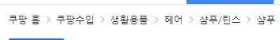

# 테크니컬 SEO 정리

## 목차

- [사이트 전체에 대한 요소](#사이트-전체에-대한-요소)
  - [암호화된 통신 대응](#암호화된-통신-대응)
  - [크롤 최적화](#크롤-최적화)

## 사이트 전체에 대한 요소

### 암호화된 통신 대응

#### https 도입 & SSL 대응

- [**Screaming Frog**](https://www.screamingfrog.co.uk/seo-spider/)

  - 웹사이트 뒷면에 있는 data를 크롤해서 데이터를 수집하는 도구
  - 메타정보, 이미지, URL 등을 추려서 csv파일로 요약해준다

- 구글 서치 콘솔로 http 및 https 여부를 확인
- mixed contents 여부 확인
  - https를 사용한 페이지에서 http로 이미지나 동영상 등을 불러왔을 때 발생하는 에러
  - ``, `<audio>`, `<video>` 태그의 src 속성에서 발생할 수 있다.
- Screaming Frog로 내부 링크 기술 확인(추천)

[⚠️ 일반적인 리다이렉트 시 문제 없으나, 만약 302 리다이렉트인 경우, 이전 URL이 계속 잔류할 가능성이 있다.](https://www.notion.so/dd723aba5f9d44b295248c81d7770fe5?pvs=21)

## 크롤 최적화

### 사이트맵 송신

#### 동적 갱신 사이트맵 작성 & 송신

**사이트맵이 GSC에 정상적으로 등록되어 있는지 확인**

- GSC → `사이트맵` 항목 확인
  - 정상적으로 등록되어 오류가 없는지 확인
- `domain/sitemap.xml` 로 존재 유무 확인
  - 사이트맵 파일명이 사이트마다 달라서 크롤러가 못찾는 경우 종종 발생
- robots.txt에 기술 + GSC에서 사이트맵 확인
- 사이트맵 인덱스 파일과 xml 사이트맵 속성을 확인
  - ⭐ `<lastmod>` → 최신 갱신 날짜가 정확할 경우 사이트맵을 사용
  - 일본어 및 한국어 → **utf-8** 인코딩여부 확인
  - 특수문자는 [이스케이프](https://www.sitemaps.org/protocol.html#escaping) 되어있는가?
  - Google에서는 `<priority>` 및 `<changefreq>` 값을 무시
- 사이트맵에서 송신하고 있는 URL에 에러 존재 유무를 GSC의 커버리지 리포트에서 확인
- 송신 URL 에러는 우선적으로 대처
- 이미지이나 동영상이 많은 사이트는 [**이미지 사이트맵**](https://developers.google.com/search/docs/crawling-indexing/sitemaps/image-sitemaps?hl=ko)이나 [**동영상 사이트맵**](https://developers.google.com/search/docs/crawling-indexing/sitemaps/video-sitemaps?hl=ko)의 작성도 검토
- [**인터내셔널 타겟팅**](https://developers.google.com/search/docs/specialty/international/localized-versions?hl=ko)(`<hreflang>` 설정)을 사이트맵을 통해 설정할 수도 있음

#### 동적 갱신 사이트맵과 RSS/ATOM 피드 병용

- 크롤에게 조금 더 빠르게 웹사이트를 인식시키고 싶을때 [**RSS/ATOM**](https://developers.google.com/search/docs/crawling-indexing/sitemaps/build-sitemap?hl=ko#rss)사용
  - 사이트맵보다 조금 더 빠름
  - noindex 대응의 페이지의 경우에도 동일
- 한번에 많은 페이지 업로드보다는 주기적인 업로드가 더 중요
  - ex) 1~2주에 한번씩 꾸준히 2개의 페이지 업로드

[\*\*RSS/Atom 피드 권장 사용법](https://developers.google.com/search/blog/2014/10/best-practices-for-xml-sitemaps-rssatom) (영문)\*\*

### robots.txt

#### robots.txt에 의한 크롤링 제어

**robots.txt에서 확인 해야할 것**

- **domain/robots.txt**의 기술을 확인
  - 크롤을 차단하고 있는지 체크
  - 특히, 블록된 이미지나 CSS, JS가 크롤링에 필요한 정보일 수 있기 때문에, 자세하게 알아봐야 됨
- [**GSC의 커버리지 리포트**](https://support.google.com/webmasters/answer/7440203?hl=ko)의 경고 확인
  - `[차단 되었습니다]` 문구 확인
- robots.txt에 기술하더라도, 다른 사이트로부터 링크되고 있는 URL은 **경고 취급**되어 인덱스 되어버림
  - 즉, 경고 취급이 되는 경우에는 차단하는 것이 아니라 **noindex**로 하는 등의 대처 필요

### noindex

#### noindex를 사용한 검색 인덱스 등록 블록

- 로그인 계열 페이지의 헤드 태그에는 [**noindex**](https://developers.google.com/search/docs/crawling-indexing/block-indexing?hl=ko) 처리
- noindex와 canonical이 겸용으로 사용되지 않도록 noindex를 사용하여 검색 인덱스 등록을 차단한다

### URL의 기본 구조

#### 중복 URL 회피

**Google은 미러 컨텐츠(중복 컨텐츠)를 절대로 안된다고 못 박음**

- 다른 주소인데 내용이 같은 것 피해야 함

**URL이 다른데 내용이 중복되는 경우**

- `http` & `https`
- `/index.html` & `/index.php`
- `/endpoint` & `/endpoint/`
- `www`의 유/무

**리다이렉트 체크법**

- [리다이렉트 체크 툴](https://chromewebstore.google.com/detail/redirect-path/aomidfkchockcldhbkggjokdkkebmdll)을 사용
- GSC 에서 리다이렉트 처리되고 있는지 확인

**해결법**

- **301 영구 리다이렉트** 설정을 권장
- 불가피 할 경우 **canonical** 처리 필요

### 리다이렉트

#### 적절한 리다이렉트 설정

**[리다이렉트](https://developers.google.com/search/docs/crawling-indexing/301-redirects?hl=ko)**

URL 리다이렉트은 기존 URL을 다른 URL과 연결 지어 방문자와 Google 검색에 페이지의 위치가 새로 지정되었음을 효과적으로 알리는 방법

- **301 영구 리디렉션**: 검색결과에 새 리다이렉트 대상을 표시합니다.
- **302 임시 리디렉션**: 검색결과에 소스 페이지를 표시합니다.

**체크요소**

- 현재는 사용하지 않는 이전 페이지가 있는 경우, 현재 사용되고 있는 페이지로의 리다이렉트 존재하는지 확인
  - ScreamingFrog → Report → RedirectChain을 확인
- 리다이렉트가 여러 개 얽히거나 3**02 리다이렉트** → **404 페이지** 등의 경우는 [**제외된 `크롤 에러`**](https://support.google.com/webmasters/thread/171872848/%EC%83%89%EC%9D%B8-%EC%83%9D%EC%84%B1-%EB%B2%94%EC%9C%84-%ED%8E%98%EC%9D%B4%EC%A7%80%EC%97%90%EC%84%9C-%EC%98%A4%EB%A5%98-%EB%B0%8F-%EC%A0%9C%EC%99%B8%EB%90%A8-%ED%98%84%EC%83%81-%EB%B0%9C%EC%83%9D-%EC%9D%B4%EC%9C%A0-%EC%82%AC%EC%9D%B4%ED%8A%B8%EB%A7%B5-%EC%9D%B8%EC%8B%9D-%EC%98%A4%EB%A5%98?hl=ko)로 분류되는 경우가 있다.
- **404 페이지**에 **301 리다이렉트** 하는것은 Google도 인정하고 있는 방법이다.
  - 베스트는 **직접 404** 반환 하는 것이다.
- 기본 리다이렉트는 301을 사용을 권장한다.
- 302를 사용하는 경우
  - **모바일 버전**과 **pc 버전**의 사이트를 동시에 가진다.
  - User Agent에 따라 PC로부터의 액세스를 모바일 버전의 사이트로 리다이렉트 시키거나 할 경우
  - [A/B 테스트에서 원래 URL에서 패턴 URL로 사용자를 리다이렉트시](https://developers.google.com/search/docs/crawling-indexing/website-testing?hl=ko&visit_id=638473727792042228-417664854&rd=1)

[자바스크립트 검색 엔진 최적화의 기본사항 이해하기](https://developers.google.com/search/docs/crawling-indexing/javascript/javascript-seo-basics?visit_id=638437403321478396-2503779199&rd=1&hl=ko)

### 크롤 통계 정보

#### GSC의 크롤 통계 정보 오류 중지

- GSC→ 설정 → 크롤 통계 정보 확인
  - 평균 응답시간이 **200밀리 초 이하가 이상적**이지만, 극단적으로 1000 밀리초 이상 만 아니면 문제없음
    
- 호스트 상태 확인
  - 도메인의 모든 호스트의 성능을 한 곳에서 평가
  - 사이트 크롤의 최신 통계 정보를 확인
  - 참고: [새롭게 개선된 사이트 크롤링 통계](https://developers.google.com/search/blog/2020/11/search-console-crawl-stats-report?hl=ko)
    

### hreflang 태그 설정

#### 페이지의 현지화 버전을 Google에 전달

**로컬라이즈 페이지(다언어 페이지)**를 분석하기 위해서, 크롤러는 hreflang 태그를 참조한다.

- 가능한 모든 대상 페이지에 hreflang 태그 사용
- [**Google에 페이지의 현지화된 버전 알리기**](https://developers.google.com/search/docs/specialty/international/localized-versions?hl=ko)

### 무한 스크롤

#### 스크롤 하단의 콘텐츠를 구글에 인식시키

**무한 스크롤에 명확한 범위를 크롤러에 인식시키지 않으면 크롤러가 중도 이탈하게 된다.**

**중도 이탈이 반복될 시 사이트의 평가가 하락할 수 있음**

- 무한 스크롤의 마지막 컨텐츠를 구글 검색엔진이 이해 할 수 있도록 하기
  - [무한 스크롤 검색 친화적 추천 방법(영어)](https://developers.google.com/search/blog/2014/02/infinite-scroll-search-friendly)
- 스크롤을 통해 새 데이터가 로딩되면 URL이 변화되게(`?page=x`) 설정
  - 링크를 따라가면 검색엔진은 특정 페이지에 대해 명시적으로 접근하기 쉬워짐
- 각 페이지의 중복 여부를 확인

## 링크 및 URL의 중복 등 구조적 요소

### URL

#### 타겟 키워드 부여

- 최대한 각 페이지 URL은 한국어 및 숫자보다는 **영어**로 설정한다
- 영어로 컨텐츠 내용과 일치하는 의미를 표현하는 URL을 작성한다

#### 가독성 확보

- 아래 형식의 파일명∙디렉토리명은 피한다
  - 랜덤한 영숫자
  - page1.html
  - 매우 긴 url
  - 너무 깊은 카테고리 구조
    - 최대 2계층 권장
  - 언더바 포함 - 구글 광고를 구별할때 URL에 언더바를 사용하여 구별한다.
    .png>)
  - 스페이스 없는 영단어
    
- 특별한 사유에 의해서 영어 이외 **현지언어**로 된 단어를 사용할 경우 **UTF-8**로 인코딩한다
- 참고자료
  - [Google의 URL 구조 권장사항](https://developers.google.com/search/docs/crawling-indexing/url-structure?visit_id=638437376640496130-3890034512&rd=1&hl=ko)

#### 컨텐츠가 바뀌었는데 URL이 변경 안되는 경우(get/post. AJAX, JS, etc...)

**CSR을 사용하는 경우 클릭에 의해 컨텐츠가 전환되었지만, URL이 변하지 않는 경우가 있다.**

**→ 크롤러가 전환된 컨텐츠를 이해하지 못해서 크롤러빌리티가 떨어지게 됨**

### 체크방법

- 구글 검색에 전환된 컨텐츠에 포함된 텍스트를 `“”` 로 둘러싸서 검색(완전 일치 검색)
  - 검색 결과의 인덱스도 체크

[자바스크립트 검색 엔진 최적화의 기본사항 이해하기](https://developers.google.com/search/docs/crawling-indexing/javascript/javascript-seo-basics?visit_id=638437403321478396-2503779199&rd=1&hl=ko)

### 내부 링크 구조

#### 내부 링크 구조(페이지 구조) 최적화

- Category와 Category에서 이동한 내부 페이지의 URL이 계층 구조인지 확인
  - Category에서 이동한 페이지는 Category의 하위경로를 따라야 함
- Category 페이지가 존재하는지 확인
  - 세부 카테고리 페이지는 있으나 카테고리 페이지가 없는 경우가 존재
  - ex) `www.ex.com/category/news` 페이지는 존재
  - ex) `www.ex.com/category` 페이지는 없는 경우가 많음

[링크 보고서](https://support.google.com/webmasters/answer/9049606?hl=ko)

#### 내부 링크를 기반으로 한 디렉토리리 구조 최적화

- Top → Category → 상세페이지와 같은 **부모-자식** 구조 여부 확인
- [Breadcrumbs](https://developers.google.com/search/docs/appearance/structured-data/breadcrumb?hl=ko&sjid=12339849054891630779-AP)를 사용하여 사이트 계층 구조로 만들어진 여부를 확인
  

### 중복 배제

#### 세션 파라미터 및 캠페인 파라미터 처리

- **광고**로부터의 유입 등으로 파라미터가 포함된 URL이 있는 경우, **Canonical**로 **본래 URL**을 지정한다.
  - 광고를 통해 사이트에 유입된 경우 URL에 파라미터가 포함되게 된다.
  - 이 경우 파라미터에 의해 같은 내용의 페이지가 중복으로 존재하게 된다.
  - 중복 회피를 위해서 **Canonical**로 같은 내용의 다른 URL의 페이지를 하나의 페이지로 인식하게 설정한다.
- 참고자료
  - [rel=“cannonical” 및 다른 메서드로 표준 URL을 지정하는 방법](https://developers.google.com/search/docs/crawling-indexing/consolidate-duplicate-urls?visit_id=638437406034969353-32627999&rd=1&hl=ko)

#### 알람 페이지 중복 회피 | 범위 선택 및 정렬 페이지의 정규화

- **범위선택** 및 **재배치** 시, URL은 변경되어야 한다.
  - 쇼핑 사이트에 경우 옵션의 색상 등의 변경에 의해 URL이 변경되는 것이 권장된다.
  - 옵션에 따라 URL이 변경되면 구글의 표시되는 상품수가 늘어나 상품수 경쟁에서 우위를 가짐
- 이 경우에 **URL 변경**시 **Canonical URL** 까지 함께 변경된다면 NG이다.
  - **Canonical URL**은 상품의 기본 URL로 설정해놔야 크롤러가 중복 페이지로 인식하지 않는다.

#### 상세페이지 중복회피 | 색상 차이, 모델 번호 차이 페이지 정규화

- 색상차이, 품번차이 있는 상품의 경우 메인페이지로 Canonical
  
